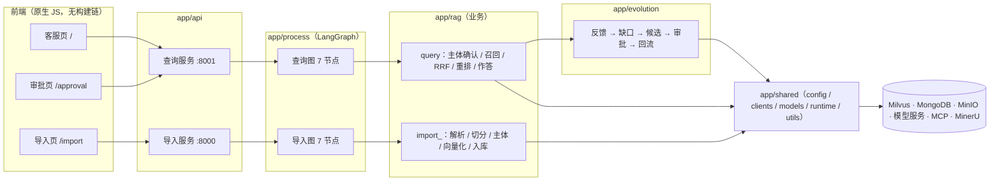

# se_rag · 企业化 RAG 知识库客服系统

面向企业的检索增强生成（RAG）客服系统：把企业文档导入向量库，在网页上用自然语言提问，
并在此基础上实现**知识自进化**——自动发现客服答不出的问题、生成知识候选，经人工审批后回流知识库。

> 三个页面：客服对话 `/`、自进化审批 `/approval`、文件导入 `/import`。
> 两个服务：导入服务 `:8000`、查询服务 `:8001`（共用同一份 `app/` 代码，仅挂载路由不同）。
> 技术栈：Python ≥3.11 · FastAPI · LangGraph · Milvus · MongoDB · MinIO · BGE-M3 / BGE-Reranker · DashScope Qwen。

## 目录

- [一、功能与定位](#一功能与定位)
- [二、架构与技术栈](#二架构与技术栈)
- [三、核心流程](#三核心流程)
- [四、快速开始](#四快速开始)
- [五、开发与测试](#五开发与测试)
- [六、注意事项与排障](#六注意事项与排障)
- [七、变更记录](#七变更记录)

## 一、功能与定位

通用大模型不了解企业内部专有知识，而企业知识更新快、人工维护成本高。本项目用
「导入 → 检索增强生成 → 反馈 → 缺口发现 → 候选生成 → 人工审批 → 回流」的闭环，让知识库随真实客服数据持续自我完善。

| 能力 | 说明 | 入口 |
| --- | --- | --- |
| 文档导入 | Markdown 直接处理；PDF 经 MinerU 云解析转 Markdown；图片自动生成说明并上传 MinIO | 导入页 `:8000/import` |
| 混合检索 | 稠密 + 稀疏（BGE-M3）混合检索；并行 HyDE 假设性检索与 MCP 联网补充 | 客服页内部 |
| 主体识别与对齐 | 从提问中识别商品主体，与库内标准名对齐；无法确认时**列出相似主体供点选** | 客服页 |
| 流式回答 | SSE 逐字输出，附引用来源（知识库 / 自进化 / 联网）与回答置信度 | 客服页 |
| 会话历史 | 按会话读取 / 清空，支持跨轮次主体的指代消解 | 客服页 |
| 用户反馈 | 每条回答可 👍/👎，反馈落库并参与自进化 | 客服页 |
| 知识自进化 | 缺口扫描 → 候选生成（含质量闸门 / PII 拦截）→ 人工审批 → 回流向量库 → 参与后续召回 | 审批页 `:8001/approval` |
| 自动调度 | 内置调度器：每轮扫描生成；（默认）每小时指标快照与参数自调、每天回测止损 | 查询服务 lifespan |
| 在线评估 | LLM 判定答案接地性；统计采纳率 / 缺口率等指标并落库 | `GET /api/evolution/status` |

**边界**：只支持 `.md` / `.pdf`；上传其他类型在入口即被拒绝（422）。知识库与自进化共用同一套 Milvus / MongoDB。

## 二、架构与技术栈

### 2.1 分层与依赖方向

依赖严格单向：`api → process → rag → evolution → shared → 外部系统`；`shared` 不反向依赖任何业务层。

| 分层 | 规模 | 职责 | 改什么时来这里 |
| --- | --- | --- | --- |
| `app/api` | 14 文件 / 578 行 | 服务组装、路由、Pydantic 契约、统一错误体、页面与静态资源 | 加接口、改路由 |
| `app/process` | 25 文件 / 371 行 | LangGraph 图与节点（薄编排，平均 15 行/文件） | 调流程分支/并行 |
| `app/rag` | 30 文件 / 2275 行 | 业务实现：解析、切分、主体识别、召回、融合、重排、作答 | 改检索/生成行为 |
| `app/evolution` | 26 文件 / 1250 行 | 反馈 → 缺口 → 候选 → 审批 → 回流；指标 / 自调 / 回测 | 改自进化规则 |
| `app/shared` | 26 文件 / 1453 行 | 唯一底座：配置单点、外部客户端、模型门面、日志、工具 | 换模型 / 换存储 |
| `app/rag_eval` | 5 文件 / 866 行 | 离线评估子系统（独立包边界） | 改评估指标 |
| `app/resources` | 18 文件 / 1888 行 | 三页 HTML + 4 CSS + 4 JS + 7 个提示词模板 | 改前端交互 |



### 2.2 技术栈

| 类别 | 技术 | 用途 | 依据 |
| --- | --- | --- | --- |
| 语言 / 依赖管理 | Python ≥3.11 + `uv` | 后端全部逻辑；`pyproject.toml` + `uv.lock` 锁版本 | `pyproject.toml:5` |
| Web | FastAPI + Uvicorn + SSE | 两个服务、Pydantic 契约、流式回答 | `app/api/http/*_server.py` |
| 编排 | LangGraph（`StateGraph`） | 导入图 / 查询图，条件边 + 并行召回 | `app/process/*/agent/main_graph.py` |
| 向量库 | Milvus（`pymilvus[model]`） | 三集合稠密 + 稀疏混合检索 | `app/shared/clients/milvus_gateway.py` |
| 文档库 | MongoDB（`pymongo`） | 会话、反馈、缺口、候选、指标、参数 | `app/shared/clients/mongo.py` |
| 对象存储 | MinIO | Markdown 图片外链（公开只读桶） | `app/shared/clients/minio_gateway.py` |
| 模型 | BGE-M3（本地，稠密+稀疏）、BGE-Reranker-Large（本地）、DashScope Qwen（云端） | 向量化、重排、生成/视觉/接地性评估 | `app/shared/models/` |
| 联网检索 | 百炼 MCP（`openai-agents` + `requests`） | 补充实时信息，失败降级为空 | `app/rag/query/web_search_service.py` |
| PDF 解析 | MinerU 云服务 | PDF → Markdown | `app/rag/import_/pdf_parse_service.py` |
| 前端 | 原生 HTML / CSS / JS | 三页 UI，无构建链 | `app/resources/` |
| 日志 | loguru | 控制台 + 文件双通道；`sys._getframe` 定位真实调用点 | `app/shared/runtime/logger.py` |
| 测试 | pytest（+ `mongomock`） | 离线单测 + 可选真机 e2e | `pyproject.toml:35-46` |

### 2.3 数据契约（改名这类操作必须绕开这些）

**Milvus 三个集合**

| 集合 | 主键 | 字段 | 向量 / 口径 |
| --- | --- | --- | --- |
| `kb_chunks` | `chunk_id` INT64 **自增** | `file_title` / `item_name` / `title` / `parent_title` / `part` / `content` | dense **COSINE** + sparse IP |
| `kb_item_names` | `pk` INT64（显式） | `file_title` / `item_name` | dense **COSINE** + sparse IP |
| `kb_evolution_items` | `evo_doc_id` VARCHAR(128)（`evo_<12hex>`） | `faq_question` / `faq_answer` / `source_refs` / `item_name` / `status` / `file_title` | dense **IP**（BGE-M3 已 L2 归一化） |

**MongoDB 六个集合**（库名见 `MONGO_DB_NAME`）

| 集合 | 内容 | 唯一写入者 |
| --- | --- | --- |
| `chat_message` | 会话历史（含 `citations` / `groundedness`） | `history_repository.save_message` |
| `fb_events` | 反馈事件（`adopt` / `thumbs` / `cited_chunk_ids` / `item_names` / `source`） | `app/evolution/feedback/collector.py` |
| `k_gaps` | 知识缺口（`confidence` / `signals` / `status`） | `app/evolution/gap/detector.py` |
| `k_candidates` | 候选知识（`draft` / `need_info` / `active` / `rejected` / `deprecated`） | 生成器 + 审批状态机 |
| `k_metrics` | 指标快照（`adopt_rate` / `gap_rate` / `params_snapshot`） | `app/evolution/online_eval/metrics.py` |
| `param_registry` | 参数注册表（`RRF_K` / `RRF_TOP` / `RERANK_TOP_K` + `rev`） | `app/evolution/tuning/param_registry.py` |

**三条不变式**（改动前先想清楚）

1. 集合名与字段名属数据契约；LangGraph `state` 键名、SSE 事件名同理。
2. `kb_chunks` 是自增主键 + 「按 `file_title` 先删后插」→ **重复导入会重新分配 `chunk_id`**，绑在它上面的评估标注会失效。
3. `EVOLUTION_*` 开关语义、`app/rag_eval` 包边界保持不变。

## 三、核心流程

### 3.1 导入流程（:8000，7 节点）

```
POST /api/import/upload   校验扩展名（仅 md/pdf）→ 落盘 → 后台任务 → 立即返回 task_ids
  → node_entry                     按后缀分派 md / pdf，写 file_title
  → node_pdf_to_md                 仅 PDF：MinerU 解析（轮询 600s 上限 / 3s 间隔）→ 下载解压
  → node_md_img                    图片 → 视觉模型生成说明 → 上传 MinIO → 链接替换
  → node_document_split            标题粗切 → 超长细切(>1000 字) → 同标题短块合并(<400 字)
  → node_item_name_recognition     LLM 读前 10 片识别主体 → 归并库内标准名 → 写 kb_item_names
  → node_bge_embedding             分批（6 条/批）生成稠密 + 稀疏向量
  → node_import_milvus             按 file_title 先删后插（幂等覆盖）写 kb_chunks
```

不支持的文档类型会显式标记任务 `FAILED`（图内会静默走到 END，靠业务层兜底），不会出现「已完成但未入库」。
进度记录不立即清理，由 `TASK_STATE_TTL_SECONDS`（默认 6h）回收，保证前端仍能轮询到终态。

### 3.2 查询流程（:8001，7 节点 + 1 条条件短路）

```
POST /api/query    流式：先建 SSE 通道再后台执行，立即返回 session_id；非流式：同步等待
  → node_item_name_confirm   历史上下文 → LLM 抽主体 + 改写问题 → 向量对齐 → 四态判定
  → 条件边                   主体已确认 → 继续；未确认（answer 已就绪）→ 直接作答 END
  → 并行三路召回             ① 知识库混合检索（含自进化条目）② HyDE 假设性检索 ③ MCP 联网（失败降级空）
  → node_rrf                 多路 RRF 融合，强制并入自进化权威条目
  → node_rerank              本地优先排序 → 限联网条数 → BGE-Reranker 打分 → 累计断崖截断 → 权威条目保底
  → node_answer_output       有现成答案则跳过 LLM；否则作答 → 抽图 → 回填引用/信号/接地性 → 落库
  → SSE final + close        返回 answer / citations / groundedness / item_name_options
```

**主体确认四态**（`app/rag/query/item_name_confirm_service.py`）：

| 判定 | 触发条件 | 行为 |
| --- | --- | --- |
| 确认 | 完整命中库内标准名，或 top1 达下限且与次优主体间距达标 | 正常多路召回 |
| 可选 | 向量分落在 `0.60 ~ 0.65` 区间 | 列出候选主体，请用户点选 |
| 相似 | 目录子串 / token 前缀 / 问句里出现库内关键词 | 列相似主体供点选 |
| 无主体 | 以上都不成立 | 提示补充产品名称 |

一次提问只对 `rewritten_query` 编码一次向量，知识库与自进化两路复用。

### 3.3 自进化闭环

```
点踩 / 零命中 / 命中却答不出
  → fb_events（30s 幂等窗口）
  → 缺口扫描（ts 升序 + 游标；加权置信度分级 strong / weak / none）
  → 候选生成（LLM 提炼 FAQ；无证据或疑似「无信息」→ need_info；命中 PII / 重复 → rejected）
  → 人工审批（通过 / 驳回 / 编辑，写操作需 X-Internal-Token）
  → 索引回流（kb_evolution_items，status=active；源缺口回写 resolved / rejected）
  → 后续查询经 RRF 并入、重排置顶，引用标签显示「自进化」
```

| 闸门 | 规则 | 目的 |
| --- | --- | --- |
| 缺口分级 | `strong ≥ 0.65`、`weak ≥ 0.45`（权重 user/retrieval/generation = 0.4/0.3/0.3） | 只有 strong 才生成候选 |
| 缺口去重 | **按问题**（不是按会话）+ 1 小时窗口 | 同一会话的后续新问题仍能被扫到 |
| 候选质量 | 无证据 → `need_info`；答案像「未提及…建议联系官方」→ 拒绝通过 | 不让伪知识入库 |
| 回测止损 | 观察窗内命中 ≥ `EVOLUTION_BACKTEST_MIN_HITS`（默认 3）且拒绝率超限才下架 | 防单条差评误杀已审批知识 |

调度节拍（`app/evolution/scheduler.py`）：每轮扫描生成；指标快照 + 参数自调按 `EVOLUTION_METRIC_INTERVAL_MINUTES`（默认 60 分钟）；
回测止损按 `EVOLUTION_BACKTEST_INTERVAL_HOURS`（默认 24 小时）。参数自调基线取**历史**快照，避免与本轮快照自比自。

### 3.4 SSE 协议与前端

| 事件 | 载荷要点 |
| --- | --- |
| `ready` | 连接建立（服务端先回放订阅前缓冲，避免 POST 与 GET 竞态） |
| `progress` | `status` / `done_list` / `running_list`（节点进度） |
| `delta` | `delta`（LLM 增量文本） |
| `final` | `answer` / `image_urls` / `item_names` / `citations` / `groundedness` / `item_name_options` |
| `error` | `code` / `message` |
| `close` | 服务端关闭（前端停止等待） |

前端三页共用 `/static/app.js`（`fetchJson` / `openStream` / `formatDateTime` / `checkFreshness` 等），
页面自身只管业务交互；资源以 `?v=<内容指纹>` 引用，`/api/health` 回传同一指纹，发现页面过期会提示刷新。

## 四、快速开始

### 4.1 环境要求

- Python ≥ 3.11（推荐用 `uv` 管理依赖）
- 可访问的 Milvus / MongoDB / MinIO
- DashScope（Qwen）API Key；本地 BGE-M3 与 BGE-Reranker-Large 模型文件
- 可选：MinerU API Token（仅导入 PDF 需要）、百炼 MCP 地址（联网检索）

### 4.2 安装

```bash
uv sync                 # 依据 pyproject.toml + uv.lock 创建 .venv 并安装依赖
```

### 4.3 配置（项目根目录 `.env`）

> `app/shared/config/common.py` 使用 `load_dotenv(override=True)`：**`.env` 会覆盖同名系统环境变量**，
> 想用环境变量临时改配置会失效。不要提交真实密钥。

| 分组 | 变量 |
| --- | --- |
| LLM | `OPENAI_API_KEY`、`OPENAI_BASE_URL`、`LLM_DEFAULT_MODEL`、`VL_MODEL`、`LLM_DEFAULT_TEMPERATURE` |
| 嵌入 / 重排 | `BGE_M3`、`BGE_M3_PATH`、`BGE_DEVICE`、`BGE_FP16`、`BGE_RERANKER_LARGE`、`BGE_RERANKER_DEVICE`、`BGE_RERANKER_FP16` |
| Milvus | `MILVUS_URL`、`CHUNKS_COLLECTION`、`ITEM_NAME_COLLECTION`、`EVOLUTION_COLLECTION`（默认 `kb_evolution_items`） |
| MongoDB | `MONGO_URL`、`MONGO_DB_NAME`、`MONGO_SERVER_SELECTION_TIMEOUT_MS`（默认 5000）、各集合名 `MONGO_CHAT_COLLECTION` / `EVOLUTION_FB_EVENTS_COLLECTION` / `EVOLUTION_K_GAPS_COLLECTION` / `EVOLUTION_K_CANDIDATES_COLLECTION` / `EVOLUTION_K_METRICS_COLLECTION` / `EVOLUTION_PARAM_REGISTRY_COLLECTION` |
| MinIO | `MINIO_ENDPOINT`、`MINIO_ACCESS_KEY`、`MINIO_SECRET_KEY`、`MINIO_BUCKET_NAME`、`MINIO_IMG_DIR`、`MINIO_SECURE` |
| 外部服务 | `MINERU_BASE_URL`、`MINERU_API_TOKEN`、`MCP_DASHSCOPE_BASE_URL`、`MCP_TIMEOUT_SECONDS`（默认 30） |
| 服务 | `APP_HOST`（默认 0.0.0.0）、`IMPORT_APP_PORT`（8000）、`QUERY_APP_PORT`（8001）、`CORS_ORIGINS`、`APP_ENV`、`IMPORT_APP_NAME`、`QUERY_APP_NAME` |
| 日志 | `LOG_CONSOLE_ENABLE` / `LOG_CONSOLE_LEVEL` / `LOG_FILE_ENABLE` / `LOG_FILE_LEVEL`（默认 INFO）/ `LOG_FILE_RETENTION`（默认 `7 days`） |
| 运行期 | `TASK_STATE_TTL_SECONDS`（默认 21600）、`WEB_MAX_IN_CONTEXT`（默认 2）、`CHUNK_DENSE_METRIC` / `ITEM_NAME_DENSE_METRIC`（默认 COSINE） |
| 主体判定 | `ITEM_NAME_CONFIRM_MIN_SCORE`（0.65）、`ITEM_NAME_CONFIRM_MARGIN`（0.02）、`ITEM_NAME_OPTION_MIN_SCORE`（0.60）、`ITEM_NAME_CATALOG_TTL_SECONDS`（60）、`ITEM_NAME_SEARCH_LIMIT`（10） |
| 自进化 | `EVOLUTION_ENABLED`（默认 false）、`EVOLUTION_ADMIN_TOKEN`、`EVOLUTION_SCHEDULE_ENABLED` / `EVOLUTION_SCHEDULE_INTERVAL_MINUTES`、`EVOLUTION_METRIC_INTERVAL_MINUTES`、`EVOLUTION_BACKTEST_ENABLED` / `EVOLUTION_BACKTEST_INTERVAL_HOURS` / `EVOLUTION_BACKTEST_MIN_HITS`、`EVOLUTION_OBSERVE_WINDOW_DAYS`、`EVOLUTION_SCAN_BATCH`、`EVOLUTION_GEN_CONTEXT_ENABLED`、`EVOLUTION_GAP_WEIGHT_USER` / `_RETRIEVAL` / `_GENERATION`、`EVOLUTION_GAP_STRONG_THRESHOLD` / `_WEAK_THRESHOLD`、`EVOLUTION_ATTAIN_RATE_MIN`、`EVOLUTION_REJECT_RATE_MAX`、`EVOLUTION_ALARM_ADOPT_DROP`、`EVOLUTION_RECALL_LIMIT`、`EVOLUTION_RRF_WEIGHT`、`EVOLUTION_GROUNDEDNESS_MIN`、`EVOLUTION_GRAY_ENABLED` |

### 4.4 启动

```bash
# 查询服务（客服对话 + 审批后台 + 自进化接口 + 调度器）
uvicorn app.api.http.query_server:app --host 0.0.0.0 --port 8001

# 导入服务（文件上传与导入）
uvicorn app.api.http.import_server:app --host 0.0.0.0 --port 8000
```

也可用模块入口（端口取 `.env`）：`python -m app.api.http.query_server` / `python -m app.api.http.import_server`。

| 页面 | 地址 |
| --- | --- |
| 客服对话 | `http://127.0.0.1:8001/` |
| 自进化审批 | `http://127.0.0.1:8001/approval` |
| 文件导入 | `http://127.0.0.1:8000/import` |

> 首次启动较慢（BGE-M3 / BGE-Reranker 需要加载模型），属正常现象。
> **调度器只随查询服务启动**，因此不要为同一个库同时跑多个查询服务实例（无分布式锁，会重复扫描）。

### 4.5 接口速查

查询服务（:8001）：

| 方法与路径 | 说明 |
| --- | --- |
| `GET /api/health` | 健康检查（含 `asset_version` 静态资源指纹） |
| `POST /api/query` | 提交问题（`is_stream=true` 时异步执行并返回 `session_id`） |
| `GET /api/stream/{session_id}` | SSE 事件流（`ready → progress → delta → final → close`） |
| `GET /api/history/{session_id}` | 读取会话历史 |
| `DELETE /api/history/{session_id}` | 清空会话历史 |
| `POST /api/evolution/feedback` | 提交反馈（`thumbs` = 1 / -1） |
| `GET /api/evolution/candidates` | 候选列表（可按 `status` 筛选） |
| `GET /api/evolution/status` | 闭环状态（缺口/候选计数、调度进度、最近指标快照） |
| `POST /api/evolution/candidates/{id}/approve` `/reject` `/edit` | 审批写操作（需 `X-Internal-Token`） |
| `DELETE /api/evolution/candidates/{id}` | 下架候选（已入库条目同时移出向量库，需 Token） |

导入服务（:8000）：

| 方法与路径 | 说明 |
| --- | --- |
| `POST /api/import/upload` | 上传文件（仅 md / pdf，其余入口直接 422） |
| `GET /api/import/status/{task_id}` | 任务状态与节点进度 |

错误响应统一为 `{"code": "<机器码>", "message": "<中文提示>"}`。

## 五、开发与测试

### 5.1 门禁命令

```bash
python -m pyflakes app tests          # 静态检查（期望 0 输出）
python -m compileall -q app tests     # 字节码编译
pytest -q                             # 离线单测（默认 -m 'not e2e'，不访问外部服务）
E2E_ENABLED=1 pytest -m e2e tests/e2e -s   # 真机端到端（会产生模型调用与真实写库）
```

仓库当前状态：`pyflakes` 0 告警、`compileall` 通过、离线 **159 passed / 1 deselected**（33 个测试文件）。
真机 E2E 覆盖：小 md 导入 → Milvus 落库校验 → 一次查询的完整 SSE 事件序列 → 反馈与缺口扫描 → 候选审批回流；
测试数据带 `e2e_` 前缀并在用例结束后「删除 → 等待 → 复核」。

### 5.2 目录速查

| 路径 | 职责 |
| --- | --- |
| `app/api/http/*_server.py` | 服务组装（FastAPI 实例、CORS、lifespan、路由挂载） |
| `app/api/routers/` | 路由层（query / evolution / import_ / pages / health） |
| `app/api/errors.py` | 统一错误模型与异常处理器 |
| `app/process/*/agent/` | LangGraph 状态、节点与图定义 |
| `app/rag/query/` | 主体确认、检索、RRF、重排、作答、引用、历史上下文 |
| `app/rag/import_/` | 入口分派、PDF 解析、图片增强、切分、主体识别、向量化、入库 |
| `app/rag/item_name/` | 主体名配置、目录缓存、检索判定与相似兜底 |
| `app/evolution/` | feedback / gap / candidate / approval / index / online_eval / tuning / backtest / scheduler |
| `app/shared/config/` | 唯一配置出口 `settings` |
| `app/shared/clients/` | Milvus / MongoDB / MinIO 客户端与会话历史仓储 |
| `app/shared/models/` | LLM / 向量 / 重排模型入口（`llm_providers`） |
| `app/shared/runtime/` | 日志与提示词加载 |
| `app/shared/utils/` | 校验、文本归一、JSON 解析、SSE 通道、任务状态、限速 |
| `app/rag_eval/` | 离线检索评估（导入测试数据 → 分层评测 → 报告） |
| `tests/unit`、`tests/e2e` | 离线单测与真机端到端 |
| `docs/` | 架构与优化报告、浏览器联调验证报告、项目讲解 |

### 5.3 常调参数（改这些会直接改变行为）

| 参数 | 默认 | 作用 |
| --- | --- | --- |
| `ITEM_NAME_CONFIRM_MIN_SCORE` / `_MARGIN` | 0.65 / 0.02 | 主体自动确认下限与 top1–top2 间距 |
| `ITEM_NAME_OPTION_MIN_SCORE` | 0.60 | 低于它就进入「相似主体点选」兜底 |
| `RRF_K` / `RRF_TOP`（`param_registry` 可覆盖，默认 60 / 5） | 60 / 5 | RRF 平滑常数与融合后保留条数 |
| `RERANK_MAX_TOPK` / `RERANK_MIN_TOPK` / `GAP_RATIO` / `GAP_ABS` | 6 / 2 / 0.2 / 0.2 | 重排保留上限、无条件保留数、累计断崖截断 |
| `RERANK_MAX_INPUT_TOKENS` | 512 | 重排输入预算（超长先 LLM 压缩再按 token 硬截断） |
| `WEB_MAX_IN_CONTEXT` | 2 | 本地有命中时联网结果条数上限 |
| `EVOLUTION_GAP_STRONG_THRESHOLD` / `_WEAK_THRESHOLD` | 0.65 / 0.45 | 缺口分级门槛 |
| `EVOLUTION_OBSERVE_WINDOW_DAYS` / `EVOLUTION_SCAN_BATCH` | 7 / 50 | 缺口扫描窗口与每轮批量 |
| `EVOLUTION_METRIC_INTERVAL_MINUTES` / `_BACKTEST_INTERVAL_HOURS` / `_BACKTEST_MIN_HITS` | 60 / 24 / 3 | 指标、回测、回测下架门槛 |
| `TASK_STATE_TTL_SECONDS` | 21600 | 任务进度内存回收 |

`app/rag/import_/config.py` 另含切分策略：`CHUNK_MAX_SIZE` 1000 / `CHUNK_SIZE` 600 / `CHUNK_OVERLAP` 50 / `CHUNK_MIN` 400 / 向量化批大小 6。

## 六、注意事项与排障

### 6.1 必须知道的约束

- **单进程部署**：SSE 通道、任务进度、主体目录缓存、参数注册表缓存都在进程内存里，调度器也没有分布式锁。
  多 worker 会丢流、进度错乱、重复扫描；要水平扩展先引入 Redis。
- **一个端口只能有一个进程**：Windows 允许两个进程绑定同一端口，连接会被随机分发；如果「POST /api/query」与
  「GET /api/stream」落到不同进程，流式回答就会卡住。用
  `Get-NetTCPConnection -State Listen | Where-Object LocalPort -eq 8001` 确认只有一行。
- **长开的旧页面不会自动换脚本**：后端已部署新版但页面仍是旧 JS 时，会出现「按钮不渲染 / 置信度 0%」这类
  看似没修好的现象。刷新页面即可；系统检测到资源版本变化会主动提示「请按 Ctrl+F5 刷新」。
- **`.env` 覆盖系统环境变量**（`load_dotenv(override=True)`）；密钥请勿提交。
- **Milvus metric 口径必须与建表一致**：`kb_chunks` / `kb_item_names` dense 用 COSINE、`kb_evolution_items` 用 IP；
  不一致会让 Milvus 报 `metric type not match` 并静默返回 None。
- **`kb_chunks` 主键是自增的**：按 `file_title` 重导入会重新分配 `chunk_id`，绑在它上面的外部标注会失效。
- **`app/rag_eval` 会写共享 Milvus**：执行离线评估前确认不影响线上库，或改用独立集合。
- **自进化需显式开启**：`EVOLUTION_ENABLED=false` 时反馈接口仅幂等接受不落库，进化条目不参与召回。
- **审批写操作需鉴权**：未配置或未正确携带 `EVOLUTION_ADMIN_TOKEN`（请求头 `X-Internal-Token`）会被拒绝（503 / 401）。

### 6.2 常见现象 → 排查路径

| 现象 | 先看这里 | 说明 |
| --- | --- | --- |
| 提问答不出 / 没有引用 | 客服页「引用来源 / 回答置信度」→ `GET /api/evolution/status` → `logs/ui-query.out.log` | 置信度显示「未评估」表示证据为空或评估失败（不是 0 分）；日志有节点耗时与降级告警 |
| 一直回「请补充产品名称」 | 日志中 `模型识别item_name` / `相似主体` 两条 | 主体识别失败：确认库内主体名目录是否有该型号，必要时看 `ITEM_NAME_*` 阈值 |
| 审批页没有候选 | `GET /api/evolution/status` 的 gaps / candidates 计数 | 缺口扫描只处理观察窗内未解决信号；同问题在 1 小时窗口内会去重 |
| 点了「通过」但状态没变 | 审批页 toast 文案 | `need_info` 或疑似「无信息」答案会被拒绝通过，需先「编辑」补充事实 |
| 上传后一直「处理中」 | `GET /api/import/status/{task_id}` + 终端日志 | PDF 走 MinerU 轮询（600s 上限）；不支持的扩展名会在入口 422 |
| 页面样式/交互异常 | `/api/health` 的 `asset_version` 与页面脚本 `?v=` | 版本不一致即页面过期，刷新即可 |

## 七、变更记录

### 2026-09-30

- **项目更名**：`sgg_KB_RAG` → `se_rag`（本地目录、IDE 模块 `.idea/se_rag.iml`、文档标题；`pyproject.toml` 包名原本已是 `se_rag`）。
  数据契约与代码逻辑未改动，无需数据迁移。
- **README 重写**：按「定位 → 架构 → 数据契约 → 流程 → 快速开始 → 开发测试 → 注意事项与排障 → 变更记录」重组，
  补齐字段级数据契约、可调参数表与排障路径。

### 2026-09-29

- **D17（相似主体「有的出有的不出」）**：模型没抽出主体时（如「烫金机怎么安装」被判为品类）链路完全跳过目录匹配，
  只回「也没有找到相似主体」。新增 `catalog.find_names_mentioned_in()`（问句里出现库内关键词即算命中）与
  `match.similar_from_query()` 兜底链（主体名相似 → 问句关键词 → 小知识库列目录），`confirm_item_name` 在
  `item_names` 为空时也走该链路。
- **旧页面识别**：`/api/health` 增加静态资源内容指纹，前端记录本页脚本 `?v=` 并比对，不一致时提示刷新
  （此前两次把「旧页面」误判为「功能没修好」）。
- **联网来源与排序**：新增 `rerank_service.prefer_local_docs()`——本地有命中时联网文档排序分被压到不超过本地最高分，
  本地知识永远优先；`citations` 扩展为 `kb / evolution / web` 三类，联网引用带标题与原网页链接（仅 http/https），
  前端标「联网」；反馈载荷剔除联网引用，避免 URL 被当作 `chunk_id`。
- **接地性语义**：`compute_groundedness` 在证据为空 / 调用失败 / 解析失败时返回 `None`，界面显示「未评估」而不是 0%。
- **闭环接线**：`record_metric` / `adjust_step` / `run_backtest` 此前无任何调用方；现由 `run_evolution_cycle_once()`
  按周期编排（指标 60 分钟、回测 24 小时），自调基线排除本轮快照，回测新增最小命中数门槛；新增
  `GET /api/evolution/status` 并在审批页显示闭环状态。
- **缺口扫描游标**：由「取最新 batch 条」改为 ts 升序 + 游标推进并在窗口扫完后复扫，早期未解决信号不再饿死。
- **D16（没主体时给相似主体点选）**：型号前缀（如 `hak180`）主体向量分只有 0.409（低于可选阈值 0.60）时，
  不再整批丢弃候选，而是列出相似主体供点选；新增 `find_similar_names()` 与前端 `.option-btn` 渲染。
- **D15（兜底话术与图片互斥）**：命中「无法作答」话术时不再回填检索图片，避免「说答不出却给出图」。

### 2026-09-28

- **结构收敛**：删除整个 `app/infra`（对 `app/shared` 的转发包装层），配置收敛为唯一出口 `settings`；
  `evolution/repositories.py` 不再硬编码集合名、不再自建第二套 `MongoClient`。
- **接口统一**：全部挂 `/api` 前缀；页面统一 `/`、`/approval`、`/import`；错误体统一 `{code,message}`；
  SSE 事件统一为 `ready / progress / delta / final / close / error`。
- **性能与稳定性**：日志位置修正改用 `sys._getframe`（~1085µs → ~418µs/条）；单次提问查询向量只编码一次；
  SSE 改为 asyncio 通道（支持订阅前缓冲回放）；任务进度加 TTL 回收；大对象日志改为条数 + Top3；
  重排前长文本压缩改为有界并发；MCP 联网补整体超时与降级；重排输入按 token 预算硬截断。
- **缺陷修复**：`build_image_url` 运算符优先级、MinIO 键与 URL 前导斜杠不一致、PDF 下载误用轮询超时、
  Milvus 过滤表达式未转义、无标点长文切分兜底、引用构造双实现合并、Mongo 访问层自死锁（改 RLock）。
- **D1–D7**：点踩不进缺口扫描（扫描条件改为「未采纳或点踩」）；导入页 422 不再打 `console.error`；
  提示词补「型号/编号必须提取」；导入服务补 `/api/health`；历史回显 `formatTime` 未定义；
  原生 `confirm/alert` 改页内浮层；E2E 清理改为「删除 → 等待 → 复核」。
- **D8–D14**：候选知识质量闸门（无证据 → `need_info`，审批拒绝「无信息」答案，新增下架接口）；
  重排来源优先级（进化条目补 FAQ 问题文本、限联网条数、权威条目保底）；缺口去重改为按问题 + 缺口生命周期闭环；
  历史主体覆盖当前问题（提示词加「当前问题主体优先」）；前端时间显示 1970（按量级判定秒/毫秒）；
  自动会话信号因 `int` 主键校验失败被静默丢弃（统一 `str()` 归一）；👎 反馈未携带 `item_names`。
- **前端外链化与缓存**：三页内联 CSS/JS 外链为 `/static/*`（`chat.html` 36.1KB → 2.0KB）；
  资源用内容指纹 `?v=`，HTML `no-cache`、静态资源长缓存；`/static/{asset}` 白名单化。
- **测试与文档**：新增离线 `tests/unit` 与真机 `tests/e2e`；新增
  `docs/architecture-review-20260928.md`、`docs/verification-report-20260928.md`。

### 2026-09-27

- 反馈按钮渲染修复、上传类型校验、接地性评估修复、演进知识召回链路修复、商品名近重复归一、离线评估导入修复
  （详见 git 历史）。
