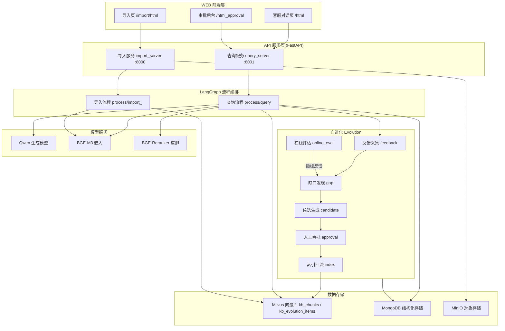
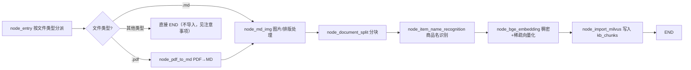
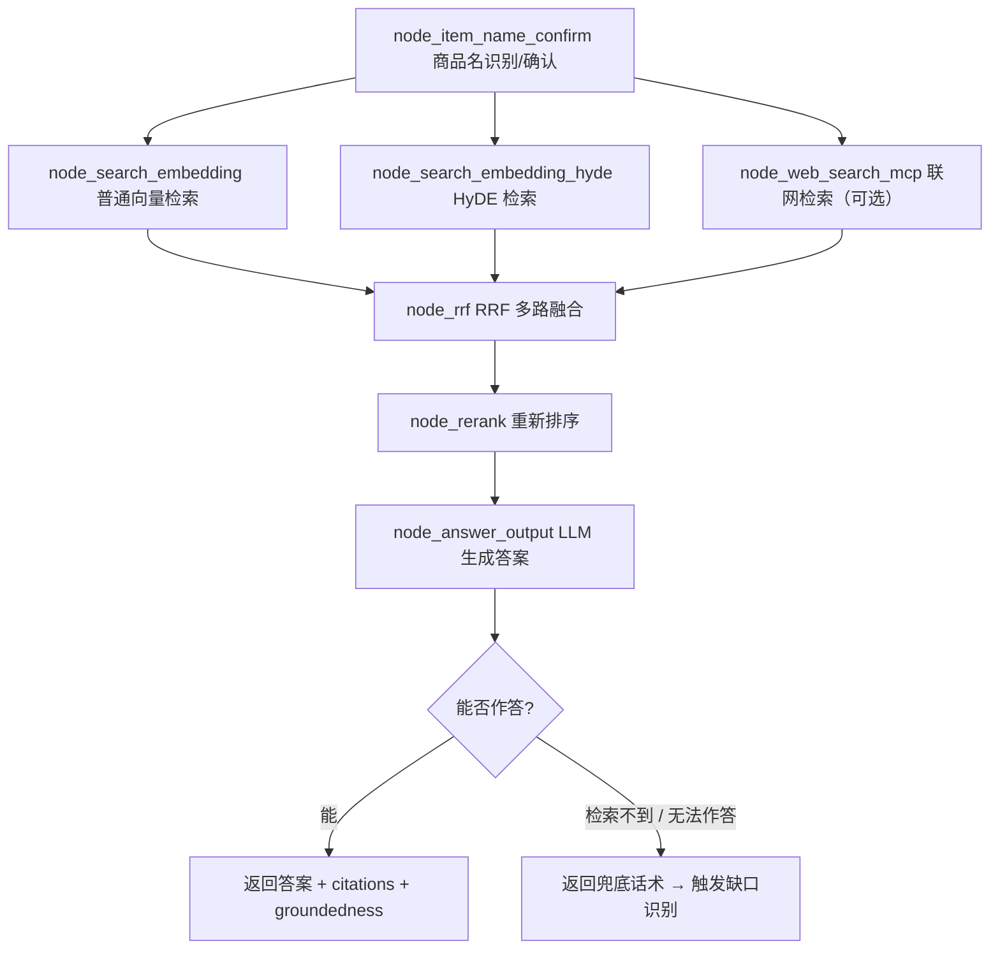
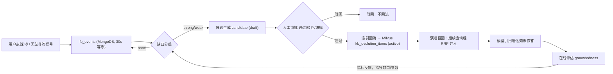

# 企业化 RAG 知识库客服系统（含自进化闭环）

一套面向企业的检索增强生成（RAG）客服系统。它把企业文档导入向量库，在网页上通过自然语言向客服提问，并在此基础上实现了「知识自进化」——自动发现客服答不出的问题、生成知识候选、经人工审批后回流知识库，让智能体越用越聪明。

> 语言注释约定：核心逻辑、关键函数与复杂流程均配有中文注释，方便中文开发团队快速上手。

---

## 目录

- [一、项目简介与核心功能](#一项目简介与核心功能)
- [二、架构设计与技术栈](#二架构设计与技术栈)
- [三、主要业务流程说明](#三主要业务流程说明)
- [四、面向最终用户的使用操作手册](#四面向最终用户的使用操作手册)
- [五、变更记录](#五变更记录)

---

## 一、项目简介与核心功能

### 1.1 项目定位

本项目解决的核心问题是：**通用大模型不了解企业内部专有知识，而企业知识更新快、手工维护知识库成本高。**

它通过「导入 → 检索增强生成 → 反馈 → 缺口发现 → 候选生成 → 审批 → 回流」的闭环，让知识库能够随真实客服数据持续自我完善，减少人工整理知识的负担。

### 1.2 解决的问题

1. **答非所问 / 无法作答**：模型对未入库的企业知识只能回复「未查询到该问题相关信息」。系统通过这些兜底话术识别知识缺口。
2. **知识库维护成本高**：由调度器自动扫描未解决反馈，批量生成知识候选，人工只需在审批后台「一键通过 / 驳回 / 编辑」，大幅降低维护成本。
3. **检索质量不稳定**：采用「普通向量检索 + HyDE 检索 + 互联网搜索 + RRF 融合 + 重排」的多路召回策略，提升答案准确率。
4. **答案可信度难以评估**：内置在线接地性（groundedness）评估，判断答案是否被检索证据支持。

### 1.3 主要特性

| 特性 | 说明 |
| --- | --- |
| 多格式文档导入 | 支持 PDF / Markdown，经解析、分块、商品名识别、向量化后入库 |
| 多路混合检索 | 普通向量检索 + HyDE 查询改写检索 + MCP 联网搜索，RRF 融合 + 重排 |
| 流式回答 | 通过 SSE 流式输出答案，附带引用片段（citations）与接地性评分 |
| 会话历史 | 按会话读取、清空历史，跨轮次上下文保持 |
| 用户反馈 | 对每条答案点赞 / 点踩，反馈数据落库 |
| 知识自进化 | 缺口扫描 → 候选生成 → 人工审批 → 回流 Milvus → 参与后续召回 |
| 自动调度 | 内置调度器按时批量扫描未解决反馈并自动生成候选 |
| 在线评估 | LLM 评估答案接地性、召回 / 采纳率 / 缺口率等指标 |
| 企业级组件 | Milvus 向量库、MongoDB 结构化存储、MinIO 对象存储、Web 审批后台 |

---

## 二、架构设计与技术栈

### 2.1 整体架构



### 2.2 应用包结构（`app/`）

| 目录 | 职责 |
| --- | --- |
| `app/api/http/` | HTTP 入口：`query_server.py`（查询 :8001）、`import_server.py`（导入 :8000） |
| `app/api/schema/` | 接口出入参 Pydantic 模型 |
| `app/process/query/agent/` | 查询流程 LangGraph 编排（节点与主图） |
| `app/process/import_/agent/` | 导入流程 LangGraph 编排 |
| `app/rag/import_/` | 导入业务逻辑（文件类型分发等） |
| `app/rag/query/` | 查询检索逻辑（RRF 融合、重排等） |
| `app/evolution/` | 自进化闭环（feedback / gap / candidate / approval / index / online_eval / scheduler / backtest / tuning） |
| `app/infra/` | 基础设施（config 聚合、vector_store、llm、mcp 等） |
| `app/shared/` | 共享能力（config 单例、clients、utils、runtime logger） |
| `app/rag_eval/` | 离线 RAG 评估（导入测试数据 → 批量检索评测 → 输出报告） |
| `app/resources/html/` | 前端页面（chat.html / approval.html / import.html） |

### 2.3 技术栈

| 类别 | 技术 |
| --- | --- |
| 语言 | Python ≥ 3.11 |
| 依赖管理 | `uv`（`pyproject.toml` + `uv.lock`） |
| Web 框架 | FastAPI + Uvicorn + SSE |
| 工作流编排 | LangGraph（`StateGraph`，节点 + 条件边） |
| 向量数据库 | Milvus（`pymilvus`） |
| 结构化存储 | MongoDB（`pymongo`） |
| 对象存储 | MinIO |
| 嵌入模型 | BGE-M3（`FlagEmbedding`） |
| 重排模型 | BGE-Reranker-Large |
| 生成模型 | DashScope Qwen（`dashscope`，OpenAI 兼容协议） |
| 文档解析 | magic-pdf / MinerU |
| 日志 / 其它 | loguru / python-dotenv / pandas / numpy / transformers |

### 2.4 数据存储

**Milvus 集合**

| 集合 | 用途 |
| --- | --- |
| `kb_chunks` | 主知识库文档分块（含稠密 + 稀疏向量） |
| `kb_item_names` | 商品名（item_name）识别索引 |
| `kb_evolution_items` | 自进化已审批知识条目 |

**MongoDB 集合（库名见 `MONGO_DB_NAME`）**

| 集合 | 用途 |
| --- | --- |
| `fb_events` | 用户反馈 / 会话未解决信号 |
| `k_gaps` | 知识缺口 |
| `k_candidates` | 审批候选 |
| `k_metrics` | 指标快照 |
| `param_registry` | 参数注册表 |
| （历史会话集合） | 会话历史读写 |

---

## 三、主要业务流程说明

### 3.1 文件导入流程

```
node_entry → node_pdf_to_md(仅PDF) / node_md_img(图片处理)
   → node_document_split(分块)
   → node_item_name_recognition(商品名识别)
   → node_bge_embedding(向量化)
   → node_import_milvus(入库 Milvus) → END
```



1. `node_entry` 根据文件后缀（`.md` / `.pdf`）分派流程；不支持的格式会提前中止（见「注意事项」）。
2. 解析成 Markdown、抽取并处理内嵌图片。
3. 文档按策略切分为 chunk。
4. 识别每个 chunk 关联的商品名（`item_name`）。
5. 用 BGE-M3 生成稠密向量（+ 稀疏向量）。
6. 写入 `kb_chunks`，供检索使用。

### 3.2 客服查询流程

```
node_item_name_confirm(商品名识别/确认)
   → node_search_embedding(普通向量检索)
   → node_search_embedding_hyde(HyDE 检索)
   → node_web_search_mcp(可选联网检索)
   → node_rrf(RRF 融合)
   → node_rerank(重排)
   → node_answer_output(生成答案 / 输出 citations)
```



1. 识别问题中的商品名，并可能结合多路线索确认。
2. 三路并行召回：普通向量检索、HyDE（先改写查询再检索）、可选的 MCP 联网搜索。
3. `node_rrf` 用 Reciprocal Rank Fusion 融合多路结果（自进化条目也会以其权重并入）。
4. `node_rerank` 用 BGE-Reranker 对融合结果精排。
5. `node_answer_output` 结合重排结果调用 LLM 生成答案；检索不到或无法作答时输出固定兜底话术（「未查询到该问题相关信息」等），这些话术是后续缺口识别的依据。

### 3.3 知识自进化闭环

```
用户反馈 👎/未解决信号
   → fb_events(MongoDB)
   → 缺口扫描(gap): 分级 strong/weak/none
   → 候选生成(candidate): LLM 提炼 FAQ 候选 → k_candidates(draft)
   → 人工审批(approval): 通过/驳回/编辑
   → 索引回流(index): 写入 Milvus kb_evolution_items
   → 进化召回(演进): 后续查询经 RRF 并入候选知识 → 在线评估(eval)
```



1. **反馈采集**：用户可在每条回答上点赞 / 点踩（`POST /evolution/feedback`）；查询链路在“零命中 / 无检索 / 无法作答”时也会自动写入未解决信号，30 秒窗口内幂等去重。
2. **缺口发现**：调度器（或手动触发）扫描未解决反馈，按「用户点踩 / 检索缺失 / 生成未解决」加权计算置信度，分级 `strong / weak / none`。
3. **候选生成**：对 strong 缺口调用 LLM，把问题提炼为「FAQ 问题 + 答案 + 来源引用 + 商品名」，生成 `draft` 候选进入审批列表。
4. **人工审批**：在审批后台 `/html_approval` 查看候选，可**通过**（→ active，注入商品名后回流 Milvus）、**驳回**、或**编辑**后通过；写入操作需携带 `X-Internal-Token` 鉴权。
5. **演进召回**：查询时 `kb_evolution_items` 中 `active` 的条目参与检索，经 RRF 融合与重排后可能被模型引用作答。
6. **在线评估**：对答案做接地性（groundedness）评估，用于衡量知识回流是否有效。

### 3.4 离线评估流程（`app/rag_eval/`）

把一组测试用例经真实导入链路入库 → 逐条走真实查询链路 → 统计各层召回效果（普通检索 / HyDE / RRF / 重排）→ 汇总平均指标 → 输出报告文件。

---

## 四、面向最终用户的使用操作手册

### 4.1 环境要求

- Python ≥ 3.11（推荐通过 `uv` 管理）
- 可访问的依赖服务：
  - **Milvus** 向量库（`MILVUS_URL`）
  - **MongoDB**（`MONGO_URL` / `MONGO_DB_NAME`）
  - **MinIO** 对象存储（`MINIO_ENDPOINT` 等）
- 可用的模型推理：
  - DashScope（Qwen）API Key 与 Base URL
  - 本地 BGE-M3 嵌入模型与 BGE-Reranker 重排模型（首次运行会自动加载，较耗时）

### 4.2 安装配置

1. **克隆并进入项目目录**后，用 `uv` 安装依赖：

   ```bash
   uv sync            # 依据 pyproject.toml + uv.lock 创建虚拟环境并安装依赖
   ```

2. **配置环境变量**：把项目根目录下 `.env` 中的各项配置改为你的实际环境。关键项包括（**请勿提交真实密钥**）：

   | 变量 | 说明 | 示例 |
   | --- | --- | --- |
   | `OPENAI_API_KEY` | DashScope API Key | `sk-xxxx` |
   | `OPENAI_BASE_URL` | DashScope OpenAI 兼容地址 | `https://dashscope.aliyuncs.com/compatible-mode/v1` |
   | `LLM_DEFAULT_MODEL` | 生成模型 | `qwen-flash` |
   | `BGE_M3_PATH` / `BGE_M3` | BGE-M3 本地路径或模型名 | `BAAI/bge-m3` |
   | `BGE_RERANKER_LARGE` | 重排模型路径 | `<本地缓存>/bge-reranker-large` |
   | `MILVUS_URL` | Milvus 地址 | `http://xx.xx.xx.xx:19530` |
   | `CHUNKS_COLLECTION` | 主知识库向量集合 | `kb_chunks` |
   | `MONGO_URL` / `MONGO_DB_NAME` | MongoDB 地址与库名 | `mongodb://...:27017` / `kb002` |
   | `MINIO_*` | 对象存储配置 | `minioadmin` |
   | `IMPORT_APP_PORT` / `QUERY_APP_PORT` | 两个服务端口 | `8000` / `8001` |
   | `EVOLUTION_ENABLED` | 自进化总开关 | `true` |
   | `EVOLUTION_ADMIN_TOKEN` | 审批写操作 Token | `evoadmin_xxx` |
   | `EVOLUTION_SCHEDULE_ENABLED` | 自动调度器开关（受 `EVOLUTION_ENABLED` 总开关双重约束） | `true` |
   | `EVOLUTION_SCHEDULE_INTERVAL_MINUTES` | 自动调度间隔（分钟） | `30` |

### 4.3 启动服务

在项目根目录激活虚拟环境后，启动两个服务（建议各占一个终端窗口）：

```bash
# 查询服务（客服对话 + 审批后台 + 自进化接口），默认端口 8001
uvicorn app.api.http.query_server:app --host 0.0.0.0 --port 8001

# 导入服务（文件上传与导入），默认端口 8000
uvicorn app.api.http.import_server:app --host 0.0.0.0 --port 8000
```

也可直接执行模块入口（端口取 `.env` 配置）：

```bash
python -m app.api.http.query_server
python -m app.api.http.import_server
```

启动完成后，在浏览器访问：

| 页面 | 地址 |
| --- | --- |
| 客服对话页 | `http://127.0.0.1:8001/html` |
| 自进化审批后台 | `http://127.0.0.1:8001/html_approval` |
| 文件导入页 | `http://127.0.0.1:8000/import/html` |
| 健康检查 | `http://127.0.0.1:8001/health` |

### 4.4 常见操作步骤

**① 导入知识文档**
1. 打开导入页 `:8000/import/html`。
2. 上传 **PDF 或 Markdown** 文件。
3. 等待任务处理完成（`completed` + 入库 chunk 数），随后即可在客服页检索到该知识。

**② 客服问答**
1. 打开客服对话页 `:8001/html`。
2. 在输入框用自然语言提问（尽量带上商品名，例如“HAK 180 电源适配器的工作温度上限是多少”）。
3. 等待流式回答；回答下方会显示引用片段与「👍 有帮助 / 👎 没帮助」按钮。
4. 如回答不准确，点击 **👎 没帮助**，该反馈会进入自进化通道。

**③ 自进化审批（知识回流）**
1. 打开审批后台 `:8001/html_approval`。
2. 查看 `draft` 候选（由缺口扫描自动生成）。建议用问题 / 商品状态等筛选定位目标。
3. 对合理候选点「**通过**」→ 触发回流；对无效候选「**驳回**」；也可先「**编辑**」问题与答案再通过。

**④ 查看/清空会话历史**
- 通过会话标识读取历史；不再需要的会话可调用清空接口清理（对不存在的会话清空也安全返回）。

### 4.5 常用接口速查

| 方法与路径 | 说明 |
| --- | --- |
| `GET /health` | 健康检查 |
| `POST /query` | 提交问题（JSON body） |
| `GET /stream/{session_id}` | SSE 流式回答 |
| `GET /history/{session_id}` | 读取会话历史 |
| `POST /evolution/feedback` | 提交反馈（body 含 `session_id`；`thumbs`=1/-1） |
| `GET /evolution/candidates` | 候选列表（可带 `status` 筛选） |
| `POST /evolution/candidates/{id}/approve` | 通过候选（需 Token） |
| `POST /evolution/candidates/{id}/reject` | 驳回候选（需 Token） |
| `POST /evolution/candidates/{id}/edit` | 编辑候选后通过（需 Token） |
| `POST /upload` | 上传文件导入（md/pdf） |

> 审批类的写操作需在请求头携带 `X-Internal-Token`，其值必须与 `EVOLUTION_ADMIN_TOKEN` 一致。

### 4.6 注意事项与常见问题

- **只支持 md / pdf 上传（入口即拒绝）**：上传其它类型文件时，`/upload` 会在写盘前直接返回 **HTTP 422**（`detail="仅支持 md / pdf 格式文件"`），导入页对应条目显示红色「失败」徽标（当前前端未把 `detail` 文案透出到界面）。图执行后另有一层防御：若最终状态既无 `md_path` 也无 `pdf_path`，任务会被标记为 `FAILED`，不会再出现「已完成但未入库」的静默成功。
- **反馈入口始终渲染**：每条回答下方的「👍 有帮助 / 👎 没帮助」不依赖引用或置信度是否存在。即使回答是「无法作答 / 无引用」，也保留反馈入口——自进化链路把这类回答视为重要负反馈来源。引用来源块与置信度条则按各自数据条件显示。
- **自进化需显式开启**：仅当 `EVOLUTION_ENABLED=true` 时，反馈才会落库、缺口才会扫描、进化条目才会参与召回；默认 `false` 时反馈接口仅幂等接受不落库。
- **审批写操作鉴权**：未配置或未正确携带 `EVOLUTION_ADMIN_TOKEN`（`X-Internal-Token`）时，通过 / 驳回 / 编辑将被拒绝。
- **兜底话术是缺口依据**：若检索到内容但模型仍回复「未查询到该问题相关信息 / 无法作答」，也会被记录为未解决信号并进入缺口扫描。
- **反馈幂等**：同一会话、问题、反馈类型在 30 秒内的重复提交会被去重，避免信号放大。
- **首次启动较慢**：BGE-M3 / BGE-Reranker 首次加载或下载耗时较长，属正常现象。
- **调度器开关与间隔**：自动扫描需同时满足 `EVOLUTION_ENABLED=true` 与 `EVOLUTION_SCHEDULE_ENABLED=true`（后者默认开启），间隔由 `EVOLUTION_SCHEDULE_INTERVAL_MINUTES` 控制（默认 30 分钟；本项目示例配为 1 分钟，生产建议 ≥30 分钟）。调度器随查询服务进程的 `lifespan` 启停，因此仅在**单 worker** 部署下有效。
- **离线评估会写库**：`app/rag_eval` 的批量评估会把合成测试数据写入共享 Milvus 并加载重排大模型，请在确认不影响线上库后再执行。

### 4.7 常用开发 / 验证命令

```bash
# 语法与导入检查（仅能发现语法 / 部分导入错误，发现不了运行期 NameError）
python -m py_compile app/api/http/query_server.py

# 验证评估模块就绪状态（含 Milvus / Mongo / 模型连通性）
python -c "from app.rag_eval import runner; print(runner.insert_env_ready(), runner.batch_eval_ready(), runner.milvus_ready())"

# 运行测试
uv run pytest
```

---

## 五、变更记录

### 2026-09-27

**① 反馈按钮渲染修复（重要）**

- **现象**：客服页回答下方「👍 有帮助 / 👎 没帮助」按钮不出现，且浏览器控制台**没有任何报错**；引用来源块、置信度条也一并缺失。
- **根因**：消息骨架中 `.meta` 位于内层容器 `div[min-width:180px]` 内，并非消息根节点 `.msg.bot` 的直接子节点。`renderCitationsAndFeedback` 用 `msgEl.insertBefore(wrap, metaEl)` 插入引用/反馈块时抛 `NotFoundError: ... is not a child of this node`，而该异常被 SSE 回调的 `try{...}catch(_){}` 静默吞掉——表现为「代码完整但 UI 元素凭空消失、无日志」。
- **修复**：改为 `metaEl.parentNode.insertBefore(wrap, metaEl)`；并移除「无引用且无置信度即不渲染反馈栏」的守卫，保证「无法作答 / 无引用」的回答同样保留反馈入口。
- **验证**：真实 Chrome 点按回归 R1–R6 全部通过——渲染 → 点按 → 置灰与「已反馈」标记 → 重复点击去重 → 跨回答独立性（DOM 校验 `["DD#done","DD#done"]`）→ 落库一致。
- **排查经验**：凡「函数存在但元素不渲染且无报错」，优先怀疑被 `try/catch` 吞掉的 DOM 异常；在 DevTools 控制台依次执行 `typeof <fn>`（排除缓存旧版）→ `document.querySelectorAll('<sel>').length`（确认未渲染）→ 手动调用函数读异常堆栈，三步即可收敛到具体缺陷。

**② 上传类型校验（L1）**

- `/upload` 在写盘前校验扩展名，非 `.md / .pdf` 直接返回 `HTTP 422`（`detail="仅支持 md / pdf 格式文件"`）。
- `invoke_import_graph` 在 `invoke` 后增加结果防御：最终状态既无 `md_path` 也无 `pdf_path` 时置为 `FAILED`。
- 效果：杜绝「已完成但未入库」的静默成功。

**③ 接地性（groundedness）评估修复**

- **根因**：评估 prompt 模板中的 JSON 结构示例花括号未转义，被 `.format()` 当作占位符解析并抛 `KeyError`，异常被吞后分数长期恒为 `0`。
- **修复**：示例花括号双写转义（`{{...}}`），保留真实的 `{context}` / `{answer}` 占位符。

**④ 演进知识召回链路修复**

- **写入端**：`item_names` 贯通「反馈 → 缺口 → 候选」三层，落库 Milvus 的 `item_name` 为真实商品名，而非占位符 `default_item_name`。
- **读取端**：对 `item_name == 'default_item_name'` 的条目兜底放行，避免被商品名过滤剔除导致召回为空。
- **融合层**：`rrf_service` 在 RRF 融合后把未收录的演进条目强制并入候选集，避免权威 FAQ 因缺少主库双路命中加分而被泛化分片挤出 top-N。

**⑤ 商品名近重复归一**

- `item_name_confirm_service` 对「仅空格 / 全半角差异」的主体名（如 `HAK 180 烫金机` 与 `HAK 180烫金机`）按归一化名视为同一主体，消除因主体间距恒为 0 导致的二次确认死循环。

**⑥ 离线评估导入修复**

- `rag_eval/runner.py` 补 `from app.infra.config.providers import infra_config`，修复 `NameError: name 'infra_config' is not defined`（此类运行期错误 `py_compile` 无法发现）。