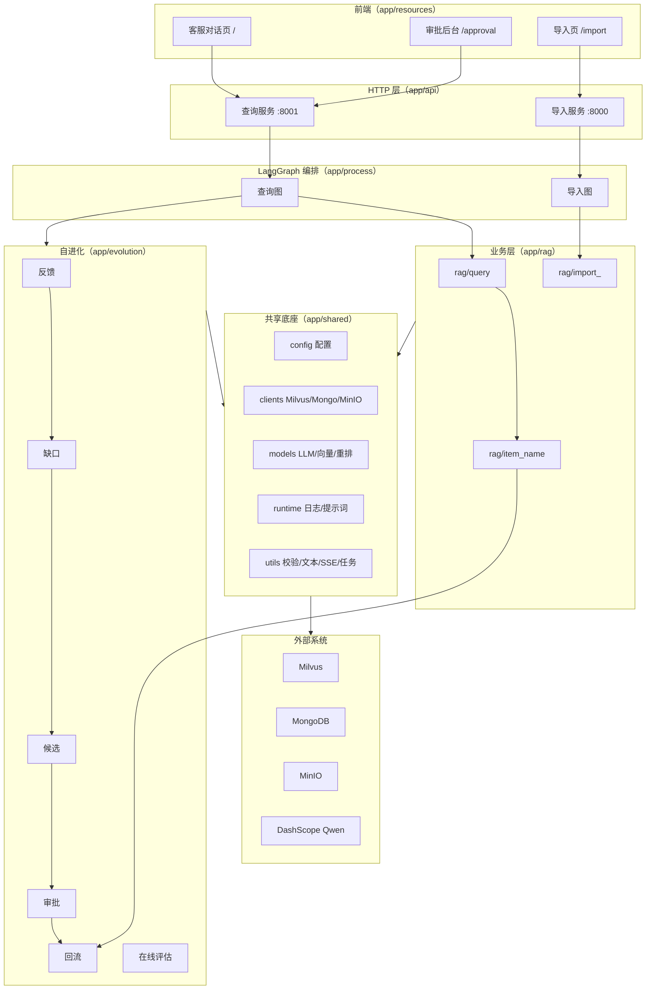

# 企业化 RAG 知识库客服系统（含自进化闭环）

面向企业的检索增强生成（RAG）客服系统：把企业文档导入向量库，在网页上通过自然语言提问，并在其
基础上实现「知识自进化」——自动发现客服答不出的问题、生成知识候选，经人工审批后回流知识库。

> 语言约定：核心逻辑、关键函数与复杂流程均配有中文注释与文档字符串，方便中文团队维护。

## 目录

- [一、功能与定位](#一功能与定位)
- [二、架构与技术栈](#二架构与技术栈)
- [三、核心流程](#三核心流程)
- [四、使用手册](#四使用手册)
- [五、开发与测试](#五开发与测试)
- [六、注意事项](#六注意事项)
- [七、变更记录](#七变更记录)

## 一、功能与定位

通用大模型不了解企业内部专有知识，而企业知识更新快、手工维护成本高。本项目通过
「导入 → 检索增强生成 → 反馈 → 缺口发现 → 候选生成 → 审批 → 回流」的闭环，让知识库随真实
客服数据持续自我完善。

| 特性 | 说明 |
| --- | --- |
| 多格式文档导入 | PDF（MinerU 云解析）/ Markdown，经切分、主体识别、向量化后入库 |
| 多路混合检索 | 普通向量检索 + HyDE 查询改写检索 + MCP 联网搜索，RRF 融合 + BGE-Reranker 重排 |
| 流式回答 | SSE 流式输出答案，附带引用片段（citations）与接地性（groundedness）评分 |
| 会话历史 | 按会话读取 / 清空历史，跨轮次上下文保持 |
| 用户反馈 | 每条答案可点赞 / 点踩，反馈落库参与自进化 |
| 知识自进化 | 缺口扫描 → 候选生成 → 人工审批 → 回流 Milvus → 参与后续召回 |
| 自动调度 | 内置调度器定时扫描未解决反馈并生成候选（单 worker 部署） |
| 在线评估 | LLM 评估答案接地性，统计召回 / 采纳率 / 缺口率等指标 |

## 二、架构与技术栈

### 2.1 分层结构

调用方向单向，禁止反向依赖：

```
app/api         HTTP 组装与路由（app/api/http/*_server.py + app/api/routers/*）
app/process     LangGraph 节点编排（导入图 / 查询图）
app/rag         业务逻辑（导入链路 / 查询链路 / 主体名目录）
app/evolution   自进化闭环（反馈 / 缺口 / 候选 / 审批 / 索引 / 在线评估 / 参数自调）
app/shared      唯一基础设施底座（config / clients / models / runtime / utils）
app/rag_eval    离线检索质量评估子系统（可整体迁移）
app/resources   前端页面与静态资源（html / css / js / prompts）
```



### 2.2 技术栈

| 类别 | 技术 | 说明 |
| --- | --- | --- |
| 语言 / 依赖管理 | Python ≥ 3.11 + `uv`（`pyproject.toml` / `uv.lock`） | 依赖按实际引用裁剪 |
| Web | FastAPI + Uvicorn + SSE | 两个服务进程，路由统一挂 `/api` 前缀 |
| 编排 | LangGraph（`StateGraph`） | 导入图 / 查询图，节点薄封装 + 业务服务 |
| 存储 | Milvus（向量）/ MongoDB（结构化）/ MinIO（对象） | 集合与字段名属数据契约，重构期间保持不变 |
| 模型 | BGE-M3（稠密+稀疏）、BGE-Reranker-Large、DashScope Qwen | 均进程内单例，首次加载较慢 |
| 文档解析 | MinerU 云服务（HTTP） | PDF → Markdown → 图片增强 → 切分 |

### 2.3 数据存储

Milvus 集合：

| 集合 | 用途 |
| --- | --- |
| `kb_chunks` | 知识库分片（稠密 + 稀疏向量） |
| `kb_item_names` | 主体名索引（用于主体识别与目录匹配） |
| `kb_evolution_items` | 自进化已审批条目（`status == 'active'` 参与召回） |

MongoDB 集合（库名见 `MONGO_DB_NAME`）：

| 集合 | 用途 |
| --- | --- |
| `chat_message` | 会话历史 |
| `fb_events` | 反馈事件与未解决信号 |
| `k_gaps` | 知识缺口 |
| `k_candidates` | 审批候选 |
| `k_metrics` | 指标快照 |
| `param_registry` | 参数注册表（自调） |

## 三、核心流程

### 3.1 导入流程

```
node_entry（类型分派）
  → node_pdf_to_md（PDF→MD，仅 pdf）
  → node_md_img（图片说明 + MinIO 上传 + 链接替换）
  → node_document_split（标题粗切 + 超长细切 + 短块合并）
  → node_item_name_recognition（主体识别 + 归并 + 写主体名索引）
  → node_bge_embedding（稠密 + 稀疏向量）
  → node_import_milvus（同 file_title 幂等覆盖写入）
```

### 3.2 查询流程

```
node_item_name_confirm（历史上下文 + 主体识别 + 问题改写，必要时反问）
  → node_search_embedding（知识库向量检索；开启自进化时并行召回演进条目）
  → node_search_embedding_hyde（HyDE 假设性文档检索）
  → node_web_search_mcp（联网检索，失败降级）
  → node_rrf（RRF 融合，演进权威条目防挤出）
  → node_rerank（BGE-Reranker 打分 + 动态截断）
  → node_answer_output（生成答案 / 图片抽取 / 引用与接地性回填 / 落库）
```

同一次提问中，`rewritten_query` 只做一次向量化，供知识库与自进化两路检索复用。

### 3.3 自进化闭环

```
用户点踩 / 零命中 / 命中却答不出
  → fb_events（MongoDB，30s 幂等去重）
  → 缺口扫描（加权置信度分级 strong / weak / none）
  → 候选生成（LLM 提炼 FAQ + PII 拦截 + 问题级去重）
  → 人工审批（通过 / 驳回 / 编辑，写操作需 X-Internal-Token）
  → 索引回流（kb_evolution_items，active）
  → 后续查询经 RRF 并入并重排
  → 在线评估（groundedness / 采纳率 / 缺口率）+ 参数自调与回测止损
```

## 四、使用手册

### 4.1 环境要求

- Python ≥ 3.11（推荐 `uv` 管理）
- 可访问的 Milvus / MongoDB / MinIO
- 可用的模型服务：DashScope（Qwen）API Key；本地 BGE-M3 与 BGE-Reranker 模型
- 可选的 MinerU API Token（仅导入 PDF 时需要）

### 4.2 安装与配置

```bash
uv sync            # 依据 pyproject.toml + uv.lock 创建环境并安装依赖
```

配置根目录 `.env`（不要提交真实密钥）。主要变量：

| 变量 | 说明 | 缺省 |
| --- | --- | --- |
| `OPENAI_API_KEY` / `OPENAI_BASE_URL` | DashScope Key 与 OpenAI 兼容地址 | 无 |
| `LLM_DEFAULT_MODEL` / `VL_MODEL` | 生成模型 / 视觉模型 | 无 |
| `BGE_M3_PATH` / `BGE_DEVICE` / `BGE_FP16` | 嵌入模型 | 无 / cpu / false |
| `BGE_RERANKER_LARGE` / `BGE_RERANKER_DEVICE` | 重排模型 | 无 / 无 |
| `MILVUS_URL` / `CHUNKS_COLLECTION` / `ITEM_NAME_COLLECTION` | 向量库 | 无 / 无 / 无 |
| `EVOLUTION_COLLECTION` | 进化条目集合 | `kb_evolution_items` |
| `MONGO_URL` / `MONGO_DB_NAME` | MongoDB | 无 / 无 |
| `MONGO_SERVER_SELECTION_TIMEOUT_MS` | Mongo 选主超时（毫秒） | `5000` |
| `MINIO_*` | 对象存储（`MINIO_IMG_DIR` 建议 `/upload-images`） | 无 |
| `APP_HOST` / `IMPORT_APP_PORT` / `QUERY_APP_PORT` | 服务监听 | `0.0.0.0` / 8000 / 8001 |
| `TASK_STATE_TTL_SECONDS` | 任务进度内存保留时长 | `21600`（6 小时） |
| `EVOLUTION_ENABLED` | 自进化总开关 | `false` |
| `EVOLUTION_SCHEDULE_ENABLED` / `EVOLUTION_SCHEDULE_INTERVAL_MINUTES` | 调度器 | `true` / `30` |
| `EVOLUTION_ADMIN_TOKEN` | 审批写操作令牌 | 无 |
| `MCP_TIMEOUT_SECONDS` | 联网检索 MCP 超时（秒） | `30` |
| `WEB_MAX_IN_CONTEXT` | 本地有命中时，最终上下文保留的联网结果条数上限 | `2` |

### 4.3 启动服务

```bash
# 查询服务（客服对话 + 审批后台 + 自进化接口）
uvicorn app.api.http.query_server:app --host 0.0.0.0 --port 8001

# 导入服务（文件上传与导入）
uvicorn app.api.http.import_server:app --host 0.0.0.0 --port 8000
```

也可直接执行模块入口（端口取 `.env`）：`python -m app.api.http.query_server` /
`python -m app.api.http.import_server`。

| 页面 / 资源 | 地址 |
| --- | --- |
| 客服对话页 | `http://127.0.0.1:8001/` |
| 自进化审批后台 | `http://127.0.0.1:8001/approval` |
| 文件导入页 | `http://127.0.0.1:8000/import` |
| 前端公共库 / 样式 | `http://<host>/static/app.js`、`/static/app.css` |

### 4.4 接口速查

查询服务（:8001）：

| 方法与路径 | 说明 |
| --- | --- |
| `GET /api/health` | 健康检查 |
| `POST /api/query` | 提交问题（`is_stream=true` 时异步执行，返回 `session_id`） |
| `GET /api/stream/{session_id}` | SSE 事件流（`ready → progress → delta → final → close`） |
| `GET /api/history/{session_id}` | 读取会话历史 |
| `DELETE /api/history/{session_id}` | 清空会话历史 |
| `POST /api/evolution/feedback` | 提交反馈（`thumbs`=1 / -1） |
| `GET /api/evolution/candidates` | 候选列表（可按 `status` 筛选） |
| `POST /api/evolution/candidates/{id}/approve` `/reject` `/edit` | 审批写操作（需 `X-Internal-Token`） |
| `DELETE /api/evolution/candidates/{id}` | 下架候选（已入库条目同时移出向量库，需 Token） |

导入服务（:8000）：

| 方法与路径 | 说明 |
| --- | --- |
| `POST /api/import/upload` | 上传文件（仅 md / pdf，其余入口直接 422） |
| `GET /api/import/status/{task_id}` | 任务状态与节点进度 |

错误响应统一为 `{"code": "<机器码>", "message": "<中文提示>"}`（HTTP 状态码保持语义）。

## 五、开发与测试

```bash
# 静态检查（无告警为准）
python -m pyflakes app tests

# 字节码编译检查
python -m compileall -q app tests

# 离线单测（默认，不访问任何外部服务）
uv run pytest

# 真机端到端（需要真实 Milvus / MongoDB / MinIO / 模型服务，会产生模型调用费用）
E2E_ENABLED=1 uv run pytest -m e2e tests/e2e -s
```

真机 E2E 覆盖：小 md 导入 → Milvus 落库校验 → 一次查询的 SSE 全事件序列 → 反馈与缺口扫描 →
候选审批回流；测试数据均带 `e2e_` 前缀并在用例结束后清理。

### 5.1 目录速查

| 路径 | 职责 |
| --- | --- |
| `app/api/http/*_server.py` | 服务组装（FastAPI 实例、CORS、lifespan、路由挂载） |
| `app/api/routers/` | 路由层（query / import_ / evolution / pages） |
| `app/api/errors.py` | 统一错误模型与异常处理器 |
| `app/process/*/agent/` | LangGraph 状态、节点与图定义 |
| `app/rag/query/` | 检索、RRF、重排、作答、引用、历史上下文 |
| `app/rag/import_/` | 入口分派、PDF 解析、图片增强、切分、主体识别、向量化、入库 |
| `app/rag/item_name/` | 主体名配置、目录缓存、检索判定 |
| `app/evolution/` | 自进化各环节（feedback / gap / candidate / approval / index / online_eval / backtest / tuning / scheduler） |
| `app/shared/config/` | 唯一配置出口（`settings`） |
| `app/shared/clients/` | Milvus / MongoDB / MinIO 访问与仓储 |
| `app/shared/models/` | LLM / 向量 / 重排模型入口（`llm_providers`） |
| `app/shared/runtime/` | 日志（低开销位置修正）与提示词加载 |
| `app/shared/utils/` | 校验、文本归一、JSON 解析、SSE 通道、任务状态、限速 |
| `app/rag_eval/` | 离线检索评估（导入测试数据 → 分层评测 → 报告） |
| `tests/unit`、`tests/e2e` | 离线单测与真机端到端 |

## 六、注意事项

- **只支持 md / pdf 上传**：其他类型在 `/api/import/upload` 入口即返回 422；图内另有一层防御，
  若最终状态既无 `md_path` 也无 `pdf_path`，任务标记为 `FAILED`，不会出现「已完成但未入库」。
- **自进化需显式开启**：`EVOLUTION_ENABLED=false` 时反馈接口仅幂等接受不落库，进化条目不参与召回。
- **审批写操作鉴权**：未配置或未正确携带 `EVOLUTION_ADMIN_TOKEN`（`X-Internal-Token`）时
  通过 / 驳回 / 编辑会被拒绝（503 / 401）。
- **候选必须携带事实**：无检索证据或生成答案只是「未提及 / 建议联系官方」时，候选会登记为
  `need_info`（审批页显示「待人工补充」），此时无法直接通过——请先「编辑」补充真实答案，
  保存后状态自动回到 `待审批（draft）`，再通过即可被客服正常作答。
- **误批条目可下架**：审批页对 `active` 条目提供「🗑 下架」，下架后立即移出检索（历史遗留的
  「无信息」条目在召回端也会被自动过滤）。
- **兜底话术是缺口依据**：命中内容但模型仍回复「未查询到该问题相关信息 / 无法作答」也会记为未解决信号。
- **反馈幂等**：同一会话、问题、反馈类型在 30 秒内重复提交会被去重。
- **调度器单 worker**：调度器随查询服务 `lifespan` 启停，仅在单 worker 部署下有效。
- **首次启动较慢**：BGE-M3 / BGE-Reranker 首次加载耗时较长属正常现象。
- **离线评估会写库**：`app/rag_eval` 会把合成测试数据写入共享 Milvus，请在确认不影响线上库后再执行。

## 七、变更记录

### 2026-09-28 架构重构与性能优化

**① 分层收敛**

- 删除整个 `app/infra`（此前只是对 `app/shared` 的转发包装层：`InfraConfig`、`LLMProvider`、
  `MilvusGateway`、`MinioGateway`、`HistoryRepository`），能力全部并入 `app/shared` 的
  `config / clients / models / runtime / utils`；调用方向变为单向的四层结构。
- 配置收敛为唯一出口 `app/shared/config/settings.py`：原先 8 个分散的单例模块合并为聚合
  `settings`，消除 `EVOLUTION_COLLECTION` 被两处读取、`ENTITY_NAME_COLLECTION` 只读不用等问题。
- `app/evolution/repositories.py` 不再硬编码集合名、不再自建第二套 `MongoClient`（此前配置项失效
  且连接池翻倍）；全项目共用一份惰性加载的 MongoDB 连接。

**② 接口统一（前端同步改造）**

- 所有接口统一挂 `/api` 前缀，页面统一为 `/`（客服）、`/approval`（审批）、`/import`（导入），
  前端公共库统一为 `/static/app.js` + `/static/app.css`（三页不再各自实现 `esc/toast/fmtTs/fetch`）。
- 错误体统一为 `{"code","message"}`；SSE 事件名统一为 `ready/progress/delta/final/close/error`
  （原 `__close__` 改为 `close`），并去掉前端从未收到过的 `final_answer` 监听。

**③ 性能与稳定性**

- 日志位置修正从「每条日志 `inspect.stack()` 全栈遍历」改为 `sys._getframe` 逐层回溯
  （实测 ~1085µs/条 → ~418µs/条，约 2.6×），`step_log` 降为 DEBUG 级，避免每步两行 INFO 刷屏。
- 单次提问的查询向量只编码一次（知识库 + 自进化两路复用），embedding 调用由 3 次降为 2 次。
- SSE 由「`queue.Queue` + 线程池阻塞轮询（每连接占用一个线程）」改为 `asyncio` 事件通道，
  支持订阅前缓冲回放（修复 POST /query 与 /stream 的竞态），并回收空闲通道。
- 任务进度表加锁 + TTL 回收（修复导入侧字典只增不减的内存泄漏），删除从未使用的任务结果存储。
- 参数注册表加载失败也计入 TTL，避免 Mongo 不可用时每次读取都重试；Mongo 选主超时默认 5s。
- 大型对象不再整份打进 INFO 日志（改为条数 + Top3 摘要）；重排前的长文本压缩改为有界并发。
- 联网检索补整体超时与异常降级（MCP 卡住不再阻塞整条查询）；重排输入按 token 预算硬截断，
  消除超长切片的 tokenizer 越界告警。

**④ 缺陷修复**

- `build_image_url` 运算符优先级错误（`MINIO_SECURE=true` 时只返回 `"https://"`）。
- MinIO 对象键与访问 URL 的前导斜杠口径不一致（旧实现上传后的图片链接实际 404，且按前缀
  清理旧图片永远匹配不到）。
- PDF 解析结果下载误用轮询超时常量（600s），现使用独立的下载超时。
- Milvus 过滤表达式统一转义构造（此前 `item_name in [Python 列表字面量]` 未转义，含引号会解析失败）。
- 文档切分缺少「无标点长文本」兜底分隔符，导致代码块 / 表格 / 无标点长文可能整块超长入库。
- 引用构造（API 层与业务层各一份）合并为 `app/rag/query/citations.py` 单一实现。
- MongoDB 访问层锁改为可重入（修复首次读取会话历史时的自死锁）；Mongo 选主超时默认 5s。
- 联网检索补整体超时与异常降级（MCP 卡住不再阻塞整条查询）；重排输入按 token 预算硬截断。

**⑤ 浏览器真实环境联调修复（2026-09-28 下午）**

- **D1**：用户点踩不会被缺口扫描消费（扫描只查 `adopt=False`，而点踩事件 `adopt=None`），
  自进化闭环少了一条入口 → 过滤条件改为「未采纳或点踩」，并补离线用例。
- **D2**：导入页把预期业务拒绝（422）打成 `console.error` → 改为 `console.warn`，不再污染错误监控。
- **D3**：查询侧主体抽取对纯型号/编号不稳定（同句多次采样会返回空 → 「请您明确主体」兜底话术）→
  `rewritten_query_and_itemnames.prompt` 增加「型号/编号/系列代号只要指向产品就必须提取」规则。
- **D4**：导入服务缺少健康检查路由 → 新增共享 `app/api/routers/health.py`，两服务统一 `/api/health`。
- **D6**：刷新页面后历史不回显（`ReferenceError: formatTime is not defined`）→ 删除 `common.js` 后
  chat 页漏了该别名，且被 `catch(_)` 静默吞掉；已补别名、让 catch 打印错误，并新增前端静态守卫测试。
- **D5**：原生 `confirm()`/`alert()` 会阻塞渲染进程（自动化点击超时、标签页可能卡死）→
  新增公共库 `App.confirm()` 页内确认浮层，审批页驳回与问答页清空对话改用它，并新增
  「页面不得使用原生 confirm/alert/prompt」静态守卫测试。
- **D7**：`tests/e2e` 清理只删不验，Milvus 可见性延迟会留下 `e2e_sample_*` 残留 →
  清理改为「删除 → 等待 → 复核」，仍有残留则重试并最终断言失败；跑批后审计零残留。
- 依赖裁剪后做了一致性验证：`uv lock --check` 通过、已移除的直依赖在 venv 中确已不存在、
  离线 73 例与真机 E2E 均通过，浏览器三页冒烟正常（详见验证报告第 5.1 节）。

**⑥ 测试与文档**

- 新增 `tests/unit`（离线）与 `tests/e2e`（真机端到端，含导入 / SSE / 自进化闭环与数据清理）；
  `pyproject.toml` 增加 pytest 配置与 `e2e` 标记，默认只跑离线用例。
- 依赖按实际引用裁剪（移除未使用的直依赖），`pyproject.toml` 补齐项目描述。
- 新增架构与优化报告 `docs/architecture-review-20260928.md` 与浏览器联调验证报告
  `docs/verification-report-20260928.md`。

**⑦ 前端资源与外链化优化**

- 三页把内联 CSS/JS 全部外链为 `/static/{app,chat,approval,import}.{css,js}`：
  `chat.html` 36.1KB → 2.0KB（-94%）、`approval.html` 11.8KB → 1.9KB、`import.html` 12.8KB → 1.4KB。
- 公共库补齐 `create / STATUS_LABEL / renderAnswerWithImages / parseAnswerAndImages / extractUrlsLoose`
  等跨页能力，删除页内死代码；页面骨架（顶栏/品牌/面板）统一到 `app.css`。
- 缓存策略：HTML `no-cache`；静态资源 `public, max-age=86400, immutable`，并用
  `?v=<内容指纹>`（`app/api/routers/pages.py` 注入）保证更新立即生效；
  `/static/{asset}` 改为白名单路由，未登记资源 404。

**⑧ 候选知识质量闸门（修复「审批已入库但客服仍答不出」）**

- 根因：候选生成器在**无检索证据**时会把「未提及…建议联系官方」写成 FAQ 答案，审批后作为知识入库；
  客服能召回它（引用标签显示「自进化」），但内容本身没有事实，模型只能继续回答「无法作答」。
- 生成端：新增 `app/evolution/quality.py`（`looks_like_non_answer`）；无证据或生成答案疑似「无信息结论」
  的候选登记为 **`need_info`（待人工补充）**，不再产生 `draft`。
- 审批端：`approve` 拒绝 `need_info` 与「无信息」答案并回显原因；`edit` 补齐事实后**自动回到 `draft`**，
  管理员即可直接通过；新增 `DELETE /api/evolution/candidates/{id}` 与审批页「🗑 下架」按钮，
  可一键把误批入库的条目移出检索。
- 召回端：`app/evolution/retrieval.py` 过滤历史遗留的「无信息」条目，避免它们占掉引用位。

**⑨ 重排来源优先级（修复「入库了仍答不出、且没有引用」）**

- 根因：进化条目重排时只喂了答案（“配对码123456”），没带 FAQ 问题 → 跨编码器打分 0.4793；
  4 条联网结果 0.999x 全排在前面 → 动态截断在断崖处把本地知识整体切掉 → 无引用、答“无法作答”。
- 修复：① 进化条目重排文本改为「FAQ 问题 + 答案」（同一 FAQ 0.4793 → **0.9999**）；
  ② 新增 `cap_web_docs`，本地有命中时联网最多保留 2 条（`WEB_MAX_IN_CONTEXT` 可调）；
  ③ 新增 `ensure_evolution_docs`，重排截断后把权威条目补回并置于上下文最前。
- 复验：真实链路与浏览器均得到 **“HAK 180 烫金机的蓝牙配对码是123456。”** + `自进化` 引用 + 置信度 100%。

**⑩ 缺口去重改为按问题 + 缺口生命周期闭环**

- 根因：缺口去重按**会话**判定（该会话已有 pending/candidate 缺口就整条跳过），而缺口在候选通过/驳回后
  从不复位 —— 于是同一会话里**后续所有问题永远扫不到**（日志表现为「产出 strong 缺口 0 条」）。
- 修复：去重改为**按问题**（同问题有 pending 缺口、或窗口内出现过才跳过；已生成候选的问题由候选级
  `_exists_question` 去重）；`KnowledgeGap.gap_id` 透传到候选，`approve`/`reject` 把来源缺口分别标记为
  `resolved`/`rejected`，缺口不再永久残留。
- 复验：用真实未解决信号复跑调度得到 `{"scanned":1,"generated":1}`（修复前恒为 0），并产出对应缺口与候选。

### 2026-09-27

- 反馈按钮渲染修复、上传类型校验（L1）、接地性（groundedness）评估修复、演进知识召回链路修复、
  商品名近重复归一、离线评估导入修复（详见 git 历史）。
