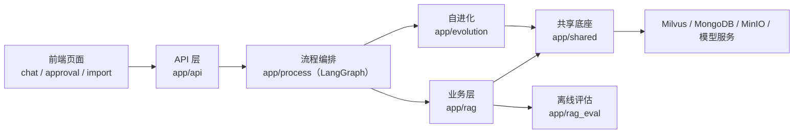

# sgg_KB_RAG 架构梳理与结构重构报告（2026-09-28）

> 本文基于只读盘点 + 重构实施后的实测结果撰写。所有结论均可回溯到文件、配置或运行记录；
> 无法从代码确认的部分显式标注为「推断」。

## 1. 概述与定位

- **一句话**：面向企业客服场景的 RAG 知识库系统，把企业文档（PDF / Markdown）导入向量库，
  用自然语言问答，并通过「反馈 → 缺口 → 候选 → 审批 → 回流」的闭环让知识库自我完善。
- **项目类型**：两个 Python Web 服务（查询服务 + 导入服务）+ 内嵌前端页面 + 离线评估子系统。
- **主要语言与框架**：Python ≥ 3.11、FastAPI + Uvicorn、LangGraph、Milvus / MongoDB / MinIO、
  BGE-M3 与 BGE-Reranker、DashScope Qwen（OpenAI 兼容协议）。

## 2. 架构总览

- **证据**：`app/api/http/{query_server,import_server}.py`（服务组装）、`app/api/routers/*`（路由）、
  `app/process/*/agent/main_graph.py`（图定义）、`app/rag/**`（业务服务）、`app/shared/**`（基础设施）。
- **边界**：`app/shared` 是唯一允许直接访问外部系统与读取环境变量的层；`app/rag` 与 `app/evolution`
  只调用共享底座暴露的接口；`app/api` 只做协议转换与编排触发。

## 3. 模块 / 分层 / 服务

| 层 | 目录 | 职责 | 依赖方向 |
| --- | --- | --- | --- |
| HTTP | `app/api` | 服务组装、路由、错误体、SSE 端点、页面与静态资源 | → `rag` / `evolution` / `shared` |
| 编排 | `app/process` | LangGraph 状态、节点、图与条件边 | → `rag` / `evolution` / `shared` |
| 业务 | `app/rag` | 导入链路（解析/切分/主体/向量/入库）、查询链路（检索/融合/重排/作答）、主体名目录 | → `shared` |
| 自进化 | `app/evolution` | 反馈、缺口、候选、审批、索引回流、在线评估、参数自调、调度 | → `shared`（+ 只读调用 `rag/query` 检索入口） |
| 共享底座 | `app/shared` | 配置（唯一 env 读取点）、外部系统客户端、模型入口、日志与提示词、通用工具 | → 外部系统 |
| 评估 | `app/rag_eval` | 合成评测数据入库、分层检索指标、报告输出 | → `rag` / `shared` |

## 4. 关键数据流与代码路径

### 4.1 导入（HTTP → 后台任务 → Milvus）

1. `POST /api/import/upload`（`app/api/routers/import_.py`）：校验扩展名与文件名 → 落盘到
   `output/<日期>/<task_id>/` → 注册后台任务 `invoke_import_graph`。
2. `app/rag/import_/pipeline.py::invoke_import_graph`：构造 `ImportGraphState` 并执行 LangGraph。
3. 图节点链路：`node_entry` → （pdf）`node_pdf_to_md` → `node_md_img` → `node_document_split`
   → `node_item_name_recognition` → `node_bge_embedding` → `node_import_milvus`。
4. 失败与降级：不支持的文档类型由 `invoke_import_graph` 显式标记 `FAILED`；图片上传单张失败仅跳过该图；
   MinerU 轮询区分「可重试（5xx / 网络抖动 / 结果未就绪）」与「不可恢复（4xx / 业务码非 0）」。

### 4.2 查询（同步 / 流式）

1. `POST /api/query`：`is_stream=false` 同步返回；`true` 时创建 SSE 通道并投递后台任务后立即返回 `session_id`。
2. `app/rag/query/pipeline.py::invoke_query_graph`：清空旧进度 → 推 `processing` → 执行查询图 →
   推 `final` + `close` → 写未解决信号。
3. 图节点链路：`node_item_name_confirm` →（主体已确认时并行）`node_search_embedding` /
   `node_search_embedding_hyde` / `node_web_search_mcp` → `node_rrf` → `node_rerank` → `node_answer_output`。
4. `GET /api/stream/{session_id}`：订阅事件通道；订阅建立前的事件进入有界缓冲并在订阅时回放，
   因此「查询已完成但前端刚连上」也不会丢 `final`。

### 4.3 自进化闭环

`node_answer_output` 回填 `retrieval_signals` → `flush_session_signals` 写 `fb_events`（30s 幂等）
→ `scan_unresolved_feedbacks` 分级缺口（`k_gaps`）→ `generate_candidate`（PII 拦截 + 去重，`k_candidates`）
→ `approve` 原子抢占 draft→active 并 `upsert_item` 到 `kb_evolution_items` → 后续查询经 `search_evolution_items`
并入 RRF → `compute_groundedness` / `compute_snapshot` / `run_backtest` / `adjust_step` 形成反馈回路。

## 5. 设计思想与模式

| 思想 / 模式 | 体现 | 收益 | 代价 |
| --- | --- | --- | --- |
| 分层架构 + 单向依赖 | `api → process → rag/evolution → shared` | 依赖清晰，替换外部系统成本低 | 需要约定纪律（已由 pyflakes + 结构约束兜住大部分） |
| 管道 / 过滤器 + 图编排 | LangGraph 节点 + 业务服务薄封装 | 节点可单测、流程可观察（进度事件） | 节点名成为跨层契约（前端进度展示依赖） |
| 编配器 + 仓储 | `EvolutionRepository` / `HistoryRepository` | MongoDB 细节不外泄，便于 mongomock 测试 | 仓储为轻封装，不做 ORM |
| 门面 | `llm_providers`（LLM / 视觉 / 向量 / 重排） | 业务层不感知模型 SDK 细节 | 模型参数只能经配置调整 |
| 降级优先 | 联网、进化召回、目录缓存、接地性评估失败均降级 | 主链路不被增强能力拖垮 | 需要日志可观测（已在关键降级点打 warning） |

## 6. 技术栈清单

| 类别 | 技术 | 用途 | 来源依据 |
| --- | --- | --- | --- |
| 语言 / 运行时 | Python ≥ 3.11 | 服务与脚本 | `pyproject.toml` |
| 依赖管理 | `uv` + `pyproject.toml` / `uv.lock` | 锁定依赖 | `pyproject.toml`、`.python-version` |
| Web 框架 | FastAPI + Uvicorn | 两个 HTTP 服务 | `app/api/**` |
| 流式协议 | SSE（`text/event-stream`） | 答案与进度推送 | `app/shared/utils/sse_broker.py` |
| 编排 | LangGraph | 导入 / 查询流程状态机 | `app/process/*/agent/main_graph.py` |
| 向量库 | Milvus（`pymilvus`） | 分片 / 主体名 / 进化条目检索 | `app/shared/clients/milvus_gateway.py` |
| 结构化存储 | MongoDB（`pymongo`） | 会话历史 + 自进化 5 类集合 | `app/shared/clients/mongo.py`、`app/evolution/repositories.py` |
| 对象存储 | MinIO | Markdown 图片托管 | `app/shared/clients/minio_gateway.py` |
| 模型 | BGE-M3、BGE-Reranker-Large、DashScope Qwen | 向量 / 重排 / 生成 | `app/shared/models/**` |
| 文档解析 | MinerU 云服务 | PDF → Markdown | `app/rag/import_/pdf_parse_service.py` |
| 日志 | loguru | 控制台 + 文件双通道、调用位置修正 | `app/shared/runtime/logger.py` |
| 测试 | pytest + mongomock | 离线单测；真机 E2E 用标记隔离 | `tests/**`、`pyproject.toml` |
| 部署 / CI | 无容器与 CI 配置（本地双进程启动） | 两服务分别 `uvicorn` 启动 | 仓库内无 `Dockerfile` / `.github/workflows`（推断：以本地或单机部署为主） |

## 7. 为什么选择该技术栈

| 技术 | 解决的问题 | 项目中的证据 |
| --- | --- | --- |
| Milvus 混合检索（稠密 + 稀疏） | 中文文档既有语义相似也有专有名词精确匹配的需求 | 三个集合均注册 `dense_vector` + `sparse_vector`，检索用 `WeightedRanker` |
| LangGraph | 多路召回需要并行 + 条件分支（主体未确认时短路） | `after_node_item_name_confirm` 返回多个目标节点实现并行 |
| MongoDB | 反馈 / 缺口 / 候选 / 指标是松结构文档，且需要按时间窗聚合 | 集合与索引定义见 `app/shared/clients/mongo.py::ensure_indexes` |
| MinIO | 图片需可被浏览器直接访问，且要随文档幂等清理 | `MinioGateway` 统一对象键与访问地址 |
| SSE 而非 WebSocket | 只有服务端单向推送需求，浏览器原生 `EventSource` 足够 | `app/resources/js/app.js::openStream` |

## 8. 替代技术栈对比

| 当前技术 | 候选替代 | 适用场景 | 性能 / 生态 | 维护与迁移成本 | 结论 |
| --- | --- | --- | --- | --- | --- |
| SSE | WebSocket | 需要双向实时交互（如协同编辑） | WebSocket 更通用但更重 | 需要自定义断线重连与消息协议 | **保持不变**：当前是单向流，SSE 更简单 |
| LangGraph | 手写编排 / 自研 DAG | 流程极简且追求极致可控 | 手写性能略优 | 失去可视化、检查点与并行调度 | **保持不变**：节点与并行语义已深度使用 |
| 双服务（8000 / 8001） | 单服务单端口 | 部署极简、共享进程内状态 | 单服务省一次连接 | 调度器与单 worker 约束会耦合，导入重活影响查询 | **保持不变**：物理隔离导入与查询，避免互相拖慢 |
| 进程内任务/SSE 状态 | Redis + 队列 | 多 worker / 多实例 | 可水平扩展 | 需引入中间件与序列化协议 | **值得试点**：仅在需要多 worker 部署时再引入 |
| Milvus | pgvector / Elasticsearch | 中小规模、少运维 | 规模与混合检索能力弱于 Milvus | 需重写 schema 与检索代码 | **保持不变**：混合检索是核心能力 |

## 9. 本次优化点与理由（含实测）

### 9.1 结构收敛（消除双底座）

| 问题（重构前） | 处理 | 理由 |
| --- | --- | --- |
| `app/infra` 与 `app/shared` 两层做同一件事（`InfraConfig` 重导单例、`LLMProvider` 包 `shared.model`、`MilvusGateway` 包 `shared.clients`、`MinioGateway` 包 `shared.clients.minio_utils`） | 删除整个 `app/infra`，能力并入 `app/shared/{config,clients,models,runtime,utils}` | 24 个文件的导入指向纯转发层，读者需要跳两层才能找到实现；单层后调用链一眼到底 |
| 8 个 `*_config.py` 各自读 env，`EVOLUTION_COLLECTION` 被两处解析、`ENTITY_NAME_COLLECTION` 只读不用 | 合并为 `app/shared/config/settings.py` 聚合 `settings` | 同一变量的单一来源；配置项可达性可静态验证 |
| `app/evolution/repositories.py` 硬编码集合名并自建第二个 `MongoClient` | 复用 `app/shared/clients/mongo.py`，集合名取自 `settings.mongo` | 修复「配置项失效」与「连接池翻倍」；`HistoryMongoTool` 原本在 **导入期** 就连库，现改为懒加载 |
| 主体名等价判定有三份实现（catalog / match / evolution.retrieval） | 收敛到 `app/shared/utils/text.py` | 三份口径不一致会导致「导入归并到 A、提问确认到 B、进化条目召回不到」 |
| LLM JSON 解析三份、引用构造两份、`_require_*` 校验十余份 | 分别收敛到 `json_utils.parse_json_object`、`rag/query/citations.py`、`utils/require.py` | 同类逻辑改一处即生效；异常语义统一 |
| 各节点/脚本的 `__main__` 演示块（含上百行 mock 数据） | 删除，改由 `tests/` 覆盖 | 生产代码不再夹带调试数据；测试成为唯一事实来源 |

### 9.2 性能与资源

| 项 | 重构前 | 重构后 | 证据 |
| --- | --- | --- | --- |
| 日志位置修正 | 每条日志 `inspect.stack()` 全栈遍历 | `sys._getframe` 逐层回溯 | 2000 条日志实测：1085.3µs/条 → 418.3µs/条（2.6×）；回归测试 `tests/unit/test_logger_perf.py` |
| 查询向量化次数 | 3 次（知识库 / 进化 / HyDE） | 2 次（query 复用 + HyDE） | `tests/unit/test_query_embedding_reuse.py` 断言同一文本只编码一次 |
| SSE 连接 | `queue.Queue` + `run_in_executor` 阻塞轮询，每连接占用一个线程池线程 | `asyncio.Queue` + `call_soon_threadsafe` | `app/shared/utils/sse_broker.py`；测试覆盖缓冲回放 |
| 任务进度内存 | 导入侧字典只增不减 | 加锁 + TTL 回收（默认 6h） | `tests/unit/test_task_state.py::test_ttl_prunes_stale_tasks` |
| Mongo 不可用时的读路径 | 参数注册表每次读取都重试连接（默认 30s 选主超时） | 失败计入 TTL + 选主超时 5s | `app/evolution/tuning/param_registry.py`、`app/shared/clients/mongo.py` |
| 大对象日志 | 整份 doc 列表打进 INFO | 条数 + Top3 摘要 | `app/rag/query/rerank_service.py` |
| 长文本压缩 | 串行逐条调用 LLM | 有界并发（≤4）+ 失败回退原文 | `create_question_answer_lists` |
| 联网检索 | 无整体超时，MCP 卡住会阻塞整条查询 | `MCP_TIMEOUT_SECONDS`（默认 30s）+ 硬超时 + 异常降级 | `app/rag/query/web_search_service.py`（真机 E2E 实测发现） |
| 重排输入长度 | 直接对超长文本 `tokenizer.encode` → 每次重排刷越界告警，压缩结果仍可能超 512 | 受限编码测长 + 按 token 预算硬截断 | `app/rag/query/rerank_service.py::_encode_capped`；`tests/unit/test_rerank_truncate.py` |
| Mongo 访问 | 客户端与数据库获取嵌套取同一把不可重入锁 | 改为可重入锁（`RLock`） | `tests/unit/test_mongo_client.py::test_get_collection_does_not_deadlock` |

### 9.3 缺陷修复

1. `MinioGateway.build_image_url` 运算符优先级错误：`MINIO_SECURE=true` 时只返回 `"https://"`；
   同时对象键带前导 `/` 而 URL 不带，导致上传后的图片实际 404、按前缀清理旧图永远匹配不到。
   现统一为「对象键不带前导斜杠、URL = scheme://endpoint/bucket/key」，并新增 `remove_images` / `upload_image`。
2. PDF 解析结果下载使用轮询超时常量（600s），现使用 `MINERU_DOWNLOAD_TIMEOUT_SECONDS`。
3. Milvus 过滤表达式由 `f"item_name in {python_list}"` 改为统一转义构造（`eq_expr` / `in_expr`），
   避免主体名含引号时表达式解析失败与注入面。
4. 文档切分缺少兜底分隔符：无标点的长文本（代码块 / 表格）不会被切开，可能整块超长入库；
   现补充空串分隔符兜底（由 `tests/unit/test_split_service.py` 覆盖）。
5. 引用构造两份实现合并为一份，保证「实时 SSE 返回」与「历史回显」一致。
6. **Mongo 访问层自死锁**（真机 E2E 实测发现，重构中引入）：`get_mongo_db()` 会在持有 `_lock` 的状态下
   调用 `get_mongo_client()`（同样要取 `_lock`），普通 `threading.Lock` 不可重入 →
   首次读取会话历史即永久阻塞（现象：进程 CPU 归零、日志停在 `node_item_name_confirm`）。
   现改为 `threading.RLock()`，并新增 5 秒超时的线程回归用例。
7. **联网检索缺少整体超时**（真机 E2E 实测发现）：MCP 客户端的 `timeout` 只作用于单次请求，
   连接/协议握手卡住时 `node_web_search_mcp` 会长时间阻塞（实测进程 10 分钟零 CPU，整条查询被拖住），
   且 `asyncio.run` 抛出的异常会直接中断查询。现已补两层防护：①`MCP_TIMEOUT_SECONDS`
   （默认 30s）之外再包一层 `asyncio.wait_for` 硬超时；②联网检索任何异常都降级为空列表，
   由重排阶段仅用本地召回继续作答。
8. **重排输入长度告警与潜在越界**：旧实现用不带 `truncation` 的 `tokenizer.encode` 测长，
   超长切片会触发 transformers 越界告警，且 LLM 压缩结果长度不可控。现统一用受限编码测长，
   并在评分前按 token 预算硬截断（真机 E2E 复跑后该告警消失）。

## 10. 接口与契约变更

| 旧路由 | 新路由 |
| --- | --- |
| `POST /query` / `GET /stream/{sid}` / `GET|DELETE /history/{sid}` / `GET /health` | `POST /api/query` / `GET /api/stream/{sid}` / `GET|DELETE /api/history/{sid}` / `GET /api/health` |
| `GET /html` / `GET /html_approval` / `GET /import/html` / `GET /js/common.js` | `GET /` / `GET /approval` / `GET /import` / `GET /static/app.js`（新增 `/static/app.css`） |
| `POST /upload` / `GET /status/{tid}` | `POST /api/import/upload` / `GET /api/import/status/{tid}` |
| `POST /evolution/feedback`、`GET /evolution/candidates`、候选写操作 | 同语义，统一挂 `/api` 前缀 |

- 错误体统一为 `{"code", "message"}`；HTTP 状态语义不变（400/401/404/422/500/503）。
- SSE 事件名统一为 `ready / progress / delta / final / close / error`（`__close__` → `close`），
  payload 键名 `status/done_list/running_list` 保持不变（前端与后端同版本发布，不保留旧路径别名）。
- **数据契约未变**：Mongo/Milvus 集合名与字段名、`EVOLUTION_*` 开关语义全部保持，无需数据迁移。

## 11. 验收与证据

| 验收项 | 结果 |
| --- | --- |
| `python -m pyflakes app tests` | 0 告警 |
| `python -m compileall -q app tests` | 通过 |
| 离线单测 `pytest`（默认 `-m 'not e2e'`） | **60 passed, 1 deselected**（约 27s） |
| 导入期无外部连接 | `tests/unit/test_api_routes_and_side_effects.py` 断言三个客户端单例仍为 `None` |
| 接口契约 | 同文件断言查询/导入服务的路由集合 |
| 真机端到端 | **1 passed**（约 57s）：md 导入 → Milvus 落库 → 查询 SSE 全事件 → 缺口扫描 → 候选审批回流 → 测试数据清理 |
| 浏览器全流程联调 | 见 `docs/verification-report-20260928.md`：三页 + 自进化闭环全部跑通；期间发现并修复 D1/D2/D3/D4/D6，修复后离线单测 **70 passed** |

真机端到端的关键观测（`logs/e2e-run4.log`）：

| 阶段 | 观测值 |
| --- | --- |
| 导入 | 切分 2 块 → 主体识别（LLM + 目录归并）5.1s → 向量化 1.3s → `insert_count=2`（0.27s） |
| 查询 | 主体确认（目录直通）1.0s；三路并列 RRF 输入 kb=5 / hyde=5 / evolution=0，输出 5 条 |
| 重排 | BGE-Reranker 加载 1.8s，10 条候选打分 24.5s（CPU），动态截断到 6 条 |
| 作答 | 852ms（含引用与接地性回填、历史落库） |
| 自进化 | 缺口扫描产出 strong 缺口 1 条 → 候选生成 → 审批写入 `kb_evolution_items`（`evo_22424c23c9e5`）→ 用例内下架清理 |

## 12. 风险与后续建议

| 优先级 | 风险 / 建议 | 收益 | 代价 |
| --- | --- | --- | --- |
| P0 | `uv.lock` 未随依赖裁剪重算（沙箱内无法访问 PyPI 镜像）；请在本地执行 `uv lock && uv sync` | 锁文件与实际依赖一致 | 需要网络与一次完整安装 |
| P1 | 会话与任务状态仍在进程内（单 worker 前提）；多 worker 部署会丢进度与 SSE | 可水平扩展 | 引入 Redis/队列，改 3 处读写 |
| P1 | `doc/` 下 86 个 PDF（约 403MB）仍在版本库中，clone 与 CI 变重（本次按用户要求保持现状） | 降低仓库体积 | 需决定是否外置语料 |
| P2 | 历史上下文按「新 → 旧」拼接（`list_recent` 为 `ts` 倒序），提示词中的「序号」语义与时间顺序相反 | 语义更直观 | 改动一行，但会改变模型输入（需回归） |
| P2 | `app/rag_eval` 会把合成数据写入共享 Milvus | 评估可重复 | 建议改为独立集合或独立库 |
| P2 | 前端仍是三份独立 HTML + 页内样式（仅公共库与设计变量已抽公共） | 进一步减重复 | 若要组件化需引入构建链 |

## 13. 证据与推断说明

- **证据**：本报告的路由、集合名、节点链路、性能数字均来自仓库内代码与本机运行输出（见第 11 节）。
- **推断**：①「无 Docker / CI 配置 → 以本地或单机部署为主」为推断；
  ②「`pandas` / `datasets` / `grandalf` 等依赖未被应用代码直接引用」基于全仓 `rg` 检索，
  若它们是被保留依赖的传递依赖，删除直依赖不影响运行时（`uv sync` 后仍需一次导入冒烟验证，见 P0）。
- **待确认**：历史上下文排序是否为有意设计（第 12 节 P2）。

## 14. 附录

### 14.1 关键文件索引

| 关注点 | 文件 |
| --- | --- |
| 服务组装 | `app/api/http/query_server.py`、`app/api/http/import_server.py` |
| 路由 | `app/api/routers/{query,import_,evolution,pages}.py` |
| 统一错误体 | `app/api/errors.py` |
| 查询编排 / 导入编排 | `app/rag/query/pipeline.py`、`app/rag/import_/pipeline.py` |
| 图定义 | `app/process/query/agent/main_graph.py`、`app/process/import_/agent/main_graph.py` |
| 检索与融合 | `app/rag/query/{chunk_search,embedding_search_service,hyde_search_service,rrf_service,rerank_service}.py` |
| 作答与引用 | `app/rag/query/{answer_service,citations,history_utils}.py` |
| 配置出口 | `app/shared/config/settings.py` |
| 外部系统 | `app/shared/clients/{mongo,milvus_gateway,minio_gateway,history_repository}.py` |
| 模型入口 | `app/shared/models/{providers,llm,embedding,reranker}.py` |
| 工具 | `app/shared/utils/{require,text,json_utils,task_state,sse_broker,rate_limit,paths}.py` |
| 自进化 | `app/evolution/**`（repositories / retrieval / scheduler / tuning / backtest） |
| 测试 | `tests/unit/**`、`tests/e2e/test_import_query_flow.py` |

### 14.2 关键外部依赖

运行期：`fastapi`、`uvicorn`、`langgraph`、`langchain-openai`、`pymilvus[model]`、`pymongo`、
`minio`、`FlagEmbedding`、`torch`、`transformers`、`numpy`、`openai-agents`、`requests`、`loguru`、`python-dotenv`。
开发期：`pytest`、`mongomock`。

### 14.3 进一步阅读

- 使用与接口速查：`README.md`
- 真机端到端用例：`tests/e2e/test_import_query_flow.py`
- 交互式架构视图：本次会话生成的 Canvas（架构总览 / 模块依赖 / 优化对照 / 接口映射）
