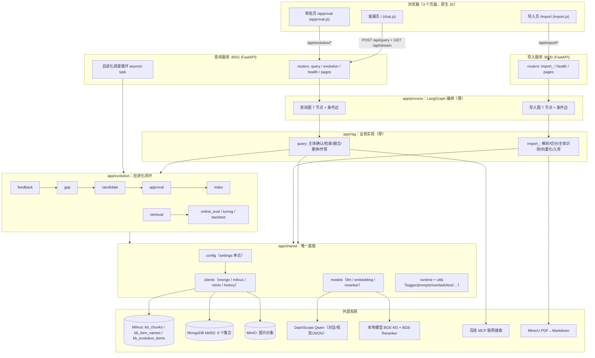
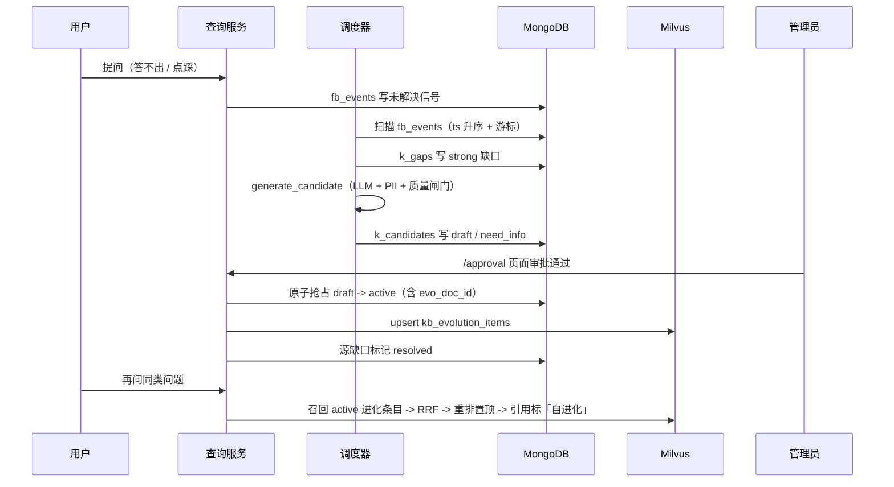

# se_rag 项目讲解报告（函数/字段级）

> 审查对象：`se_rag`（审查时目录名为 `sgg_KB_RAG`，2026-09-30 更名为 `se_rag`），代码基线 `667f2c0`。
> 分析方式：**只读**。所有结论标注 `文件:行`；无法从代码确认的写「推断/待确认」。
> 生成日期：2026-09-29。本报告与同目录 Canvas（`canvases/project-explainer.canvas.tsx`）共享同一份结论。

---

## 1. 概述与定位

一句话：**一个给企业内部客服/售后用的 RAG 知识库系统——把产品文档灌进向量库，让客服机器人照着知识库回答，再让用户反馈自动变成「待补知识」，经人工审批回流进库**。

| 项 | 内容 | 证据 |
| --- | --- | --- |
| 项目名 / 包名 | `se_rag`（原 `sgg_KB_RAG`，2026-09-30 更名） | `pyproject.toml:2` |
| 项目类型 | 两个 HTTP 服务（**导入服务 :8000** + **查询服务 :8001**）+ 3 个内置页面 + 1 个离线评估子系统 | `app/api/http/import_server.py`、`app/api/http/query_server.py`、`app/rag_eval/` |
| 主力语言 | Python >= 3.11（后端）+ 原生 JavaScript（前端，无构建链） | `pyproject.toml:5`、`app/resources/js/` |
| 核心框架 | FastAPI + Uvicorn、LangGraph（LangChain 生态）、pymilvus、pymongo、minio、FlagEmbedding（torch/transformers） | `pyproject.toml:6-25` |
| 代码规模 | `app/` 145 个文件 / 8681 行；`tests/` 33 个文件（159 条离线用例通过 / 1 条 e2e 默认跳过） | 见 §11 附录 |
| 仓库状态 | 16 次提交，HEAD `667f2c0`，工作区干净 | `git log --oneline` |
| 语料规模 | `doc/` 下 85 个 PDF（403.3 MB）随仓库保留 | 只读统计 |

**服务职责边界**（两个服务共用 `app/` 全部代码，只是挂载不同路由）：

- 导入服务：`POST /api/import/upload`、`GET /api/import/status/{task_id}`、`GET /import`（`app/api/http/import_server.py:44-47`）。
- 查询服务：客服问答、会话历史、自进化接口、审批后台（`app/api/http/query_server.py:65-69`）。

---

## 2. 架构总览



**依赖方向是单向的**：`api -> process -> rag -> evolution -> shared -> 外部系统`；
`shared` 不反向依赖任何业务层（`app/shared/config/__init__.py:1-14` 明确「业务模块只应从这里导入 `settings`」）。
判断依据：全仓 `rg` 检索不到 `app.shared` 引用 `app.rag` / `app.evolution` 的情况（**证据**）。

**服务拓扑**：

- 两个 FastAPI 实例，各自 `lifespan` 只做「确保 Mongo 索引就绪」；查询服务额外按开关启动自进化调度协程（`app/api/http/query_server.py:27-46`）。
- 只有查询服务跑调度器 → **导入服务与查询服务不能同时开两个调度器**（推断，依据：调度器是进程内 while 循环、无分布式锁，见 `app/evolution/scheduler.py:9-11` 自述「按单 worker 部署设计」）。

---

## 3. 模块 / 分层 / 服务

### 3.1 分层与规模（证据：只读统计）

| 分层 | 文件数 | 行数 | 一句话职责 |
| --- | --- | --- | --- |
| `app/rag` | 30 | 2275 | 业务实现：解析、切分、主体识别、检索、融合、重排、作答、引用 |
| `app/resources` | 18 | 1888 | 前端三页 + 4 CSS + 4 JS + 7 个提示词模板 |
| `app/shared` | 26 | 1453 | 唯一底座：配置、外部客户端、模型入口、日志、通用工具 |
| `app/evolution` | 26 | 1250 | 自进化：反馈 → 缺口 → 候选 → 审批 → 回流 → 指标/自调/回测 |
| `app/rag_eval` | 5 | 866 | 离线评估子系统（独立包边界） |
| `app/api` | 14 | 578 | HTTP 组装：服务实例、路由、schema、统一错误体、页面/静态资源 |
| `app/process` | 25 | 371 | LangGraph 图与节点（**薄编排，平均 15 行/文件**） |

> 「薄 process + 厚 rag」是本项目最鲜明的结构特征：例如 `app/process/query/agent/nodes/node_rerank.py:9` 只有 11 行，
> 真正的逻辑在 `app/rag/query/rerank_service.py:248`。读代码时「先看图，再进 rag」。

### 3.2 `app/api`：HTTP 组装层

| 文件 | 关键符号 | 职责 |
| --- | --- | --- |
| `app/api/http/query_server.py` | `lifespan`(L27)、`app`(L49) | 查询服实例：CORS、统一错误处理、挂 5 个路由、按开关起调度器 |
| `app/api/http/import_server.py` | `lifespan`(L23)、`app`(L36) | 导入服实例 |
| `app/api/errors.py` | `ApiError`(L16)、`error_body`(L26)、`install_error_handlers`(L40) | 统一错误体 `{code,message}`；业务/HTTP/校验/兜底 500 四类处理器 |
| `app/api/routers/query.py` | `query`(L29)、`stream`(L69)、`get_history`(L75)、`clear_history`(L99) | 提问（流式/非流式）、SSE、历史读写 |
| `app/api/routers/evolution.py` | `require_admin_token`(L33)、`get_status`(L80)、`approve_candidate`(L111)、`remove_candidate`(L140) | 反馈提交、候选列表、闭环状态、审批写操作（Token 鉴权） |
| `app/api/routers/import_.py` | `upload`(L30)、`task_status`(L69) | 文件上传（仅 md/pdf）与导入进度 |
| `app/api/routers/pages.py` | `asset_version`(L45)、`render_page`(L58)、`static_asset`(L79) | 三页渲染 + 白名单静态资源（内容指纹 + 长缓存） |
| `app/api/schema/` | `QueryNotStreamResponseSchema`(L28)、`HistoryItemResponseSchema`(L49) | 对外 JSON 契约（Pydantic） |

### 3.3 `app/process`：LangGraph 编排层

- 查询图（`app/process/query/agent/main_graph.py`）：7 个节点 + 1 条条件边。
  - 节点：`node_item_name_confirm`(L17) → 并行 `node_search_embedding`(L18) / `node_search_embedding_hyde`(L19) / `node_web_search_mcp`(L20) → `node_rrf`(L21) → `node_rerank`(L22) → `node_answer_output`(L23)。
  - 条件边 `after_node_item_name_confirm`(L29)：主体已确认 → 三路召回；没确认（`state["answer"]` 已就绪）→ 直接去作答 → END（L38-45）。
- 导入图（`app/process/import_/agent/main_graph.py`）：`node_entry`(L17) → 条件边 `node_entry_after`(L29) → `node_pdf_to_md`(L18) → `node_md_img`(L19) → `node_document_split`(L20) → `node_item_name_recognition`(L21) → `node_bge_embedding`(L22) → `node_import_milvus`(L23)。
- 状态：`QueryGraphState`（22 字段，`app/process/query/agent/state.py:5-42`）与 `ImportGraphState`（12 字段，`app/process/import_/agent/state.py:5-29`），逐字段说明见 §4.4。

### 3.4 `app/rag`：业务实现层

| 子包 | 关键文件与符号 | 职责 |
| --- | --- | --- |
| `rag/import_` | `entry_service.resolve_input_file`(L12)、`pdf_parse_service.parse_pdf_to_markdown`(L165)、`enrich_markdown_images.enrich_markdown_images`(L123)、`split_service.split_document`(L330)、`item_name_service.recognize_and_index_item_name`(L97)、`embedding_service.generate_chunk_embeddings`(L36)、`index_service.index_chunks`(L39) | 导入链路的 7 个业务服务 |
| `rag/query` | `item_name_confirm_service.confirm_item_name`(L110)、`embedding_search_service.search_by_embedding`(L13)、`hyde_search_service.search_by_hyde`(L20)、`web_search_service.search_by_web`(L54)、`rrf_service.fuse_by_rrf`(L47)、`rerank_service.rerank_documents`(L248)、`answer_service.generate_answer`(L142)、`citations.build_citations`(L40) | 查询链路的业务服务 |
| `rag/item_name` | `catalog.load_item_names`(L82)、`match.search_by_item_names`(L108)、`match.select_item_names`(L192)、`match.similar_from_query`(L64) | 主体名（商品名）识别与对齐：目录缓存、向量对齐、四态判定 |

### 3.5 `app/evolution`：自进化闭环

| 模块 | 关键符号 | 职责 |
| --- | --- | --- |
| `feedback/collector.py` | `record_feedback`(L33)、`flush_session_signals`(L43) | 显式点赞点踩 + 读链路自动信号 → `fb_events`（30s 幂等窗口） |
| `gap/detector.py` | `scan_unresolved_feedbacks`(L96)、`detect_and_classify`(L70)、`grade_signals`(L55) | 扫描未解决反馈 → 加权分级 → strong 缺口 |
| `candidate/generator.py` | `generate_candidate`(L66)、`_store_need_info`(L41) | LLM 提炼候选 Q/A；无证据/无信息 → `need_info`；PII/重复 → `rejected` |
| `candidate/pii.py` | `redact`(L24)、`sanitize_candidate`(L40) | 手机/身份证/邮箱等脱敏与拦截 |
| `quality.py` | `looks_like_non_answer`(L41) | 「未提及…建议联系官方」这类伪知识拦截 |
| `approval/service.py` | `approve`(L40)、`reject`(L106)、`edit`(L121)、`remove_candidate`(L149)、`_mark_gap`(L96) | 审批状态机 + 原子抢占 + 写向量库失败回滚 + 缺口状态回写 |
| `index/update.py` | `create_evolution_collection`(L34)、`upsert_item`(L58)、`deactivate`(L85) | `kb_evolution_items` 建表 / upsert / 下架 |
| `retrieval.py` | `search_evolution_items`(L79) | 召回 `status=active` 的进化条目，供 RRF 融合 |
| `scheduler.py` | `run_evolution_cycle_once`(L116)、`run_scan_and_generate_once`(L49)、`run_metrics_and_tuning_once`(L78)、`run_backtest_once`(L100)、`loop_status`(L138) | 完整闭环节拍器 |
| `online_eval/grounding.py` | `compute_groundedness`(L27) | 答案接地性（LLM 判定，失败返回 `None` = 未评估） |
| `online_eval/metrics.py` | `compute_snapshot`(L13)、`record_metric`(L35) | 采纳率/缺口率快照 → `k_metrics` |
| `tuning/` | `adjust_step`(controller.py:36)、`get_param`(param_registry.py:43)、`set_param`(L60) | 参数自调与止损回退（注册表带 10s TTL 缓存） |
| `backtest/runner.py` | `run_backtest`(L37) | 观察窗回测：拒绝率超限自动下架 |
| `repositories.py` | `EvolutionRepository`(L18) | 6 个集合访问器 + 参数读写 |

### 3.6 `app/shared`：唯一底座

| 子包 | 关键符号 | 职责 |
| --- | --- | --- |
| `config/common.py` | `env_str/env_bool/env_int/env_float`(L20-51) | `.env` 读取与类型转换（`load_dotenv(override=True)`，L14） |
| `config/settings.py` | `LLMSettings`(L18) … `Settings`(L151)、`_build_settings`(L167) | **全项目唯一配置出口**，11 个配置域 |
| `clients/mongo.py` | `get_mongo_client`(L33)、`get_mongo_db`(L48)、`ensure_indexes`(L62)、`close_mongo_client`(L87) | MongoDB 唯一连接点（懒加载 + RLock + 5s 选主超时） |
| `clients/milvus_gateway.py` | `get_milvus_client`(L22)、`escape_milvus_string`(L39)、`in_expr`(L52)、`hybrid_search`(L103)、`MilvusGateway`(L126) | Milvus 客户端/集合名/混合检索/表达式转义 |
| `clients/minio_gateway.py` | `get_minio_client`(L44)、`build_image_url`(L85)、`upload_image`(L108) | 图片对象存储与公开 URL |
| `clients/history_repository.py` | `list_recent`(L20)、`save_message`(L29)、`clear_session`(L73) | 会话历史仓储（失败降级不抛） |
| `models/` | `llm_providers`(providers.py:34)、`get_llm_client`(llm.py:15)、`get_bge_m3_ef`(embedding.py:14)、`get_reranker_model`(reranker.py:12) | 模型能力门面 + 单例加载 |
| `runtime/logger.py` | `node_log`(L105)、`step_log`(L125)、`_fix_log_position`(L75) | 日志：`sys._getframe` 定位真实调用点 |
| `runtime/prompts.py` | `load_prompt`(L18) | 提示词模板加载与渲染 |
| `utils/sse_broker.py` | `SSEEvent`(L31)、`publish`(L83)、`stream_events`(L122) | 会话级 SSE 广播（订阅前缓冲回放 + 空闲回收） |
| `utils/task_state.py` | `add_running_task`(L93)、`add_done_task`(L104)、`clear_task`(L147)、`track_node_task`(L159) | 图进度（进程内 + TTL） |
| `utils/text.py` | `normalize_item_name`(L20)、`is_same_entity`(L28)、`token_prefix_match`(L53)、`name_equivalent`(L70) | 主体名归一/等价判定（唯一实现） |
| `utils/answer.py` | `is_no_answer`(L13) | 「无法作答」判定（查询端与自进化端共用） |
| `utils/` 其他 | `require_state_str`(require.py:33)、`parse_json_object`(json_utils.py:22)、`PROJECT_ROOT`(paths.py:33)、`apply_api_rate_limit`(rate_limit.py:15) | 校验、JSON 解析、路径单点、限速 |

### 3.7 `app/rag_eval`：离线评估（独立包）

- 入口类 `RagEvalTester`（`app/rag_eval/tester.py:18`）：`run_insert_test_data`(L33) / `run_eval`(L51)。
- 四层召回指标（`app/rag_eval/runner.py:45-50`）：`embedding_chunks`（普通检索）→ `hyde_embedding_chunks`（HyDE）→ `rrf_chunks`（RRF 融合）→ `reranked_docs`（最终重排）。
- 指标实现：`compute_item_name_hit_rate`(metrics.py:79)、`compute_chunk_metrics`(metrics.py:103)、`evaluate_query_state`(metrics.py:179)。
- 该子系统会**向共享 Milvus 写入合成数据**（`insert_batch_eval_dataset`，runner.py:135）——这是它与其他模块最大的耦合点（见 §9 风险）。

---

## 4. 关键数据流与代码路径

### 4.1 导入链路（:8000，7 节点）

| 步 | 入口 | 做了什么 | 关键证据 |
| --- | --- | --- | --- |
| 1 | `POST /api/import/upload` | 校验扩展名（仅 md/pdf，其余 422）→ 落盘 → 注册后台任务 → 立刻返回 `task_ids` | `app/api/routers/import_.py:30` |
| 2 | `invoke_import_graph` | 建初始 state、跑图、写任务状态；**不支持的文档类型显式判失败** | `app/rag/import_/pipeline.py:15-30` |
| 3 | `node_entry` | 按后缀写 `md_path`/`pdf_path` 与开关、`file_title` | `app/rag/import_/entry_service.py:12` |
| 4 | `node_pdf_to_md`（仅 PDF） | MinerU 云解析：上传 → 轮询（600s 上限 / 3s 间隔）→ 下载 zip → 解压取 md | `pdf_parse_service.py:57,137,165` |
| 5 | `node_md_img` | 扫描图片 → 视觉模型生成说明 → 传 MinIO → 把链接替换成带说明的公网地址 → 另存 `<名>_new.md` | `enrich_markdown_images.py:123` |
| 6 | `node_document_split` | 标题粗切 → 超长细切（>1000 字）→ 同标题短块合并（<400 字）→ 备份 JSON | `split_service.py:330`、`import_/config.py:16-26` |
| 7 | `node_item_name_recognition` | LLM 读前 10 个切片识别主体名 → **归并到库内标准名** → 回填 chunks → 写 `kb_item_names` | `item_name_service.py:97`、`match.py:300` |
| 8 | `node_bge_embedding` | 分批（6 条/批）生成稠密 + 稀疏向量 | `embedding_service.py:36`、`import_/config.py:28` |
| 9 | `node_import_milvus` | 按 `file_title` **先删后插**（幂等覆盖）写入 `kb_chunks` | `index_service.py:39` |

失败与重试：图内异常由 `invoke_import_graph` 统一兜住并置 `FAILED`（pipeline.py:26-30）；MinerU 轮询超时视为失败；
进度记录**不立即清理**，交给 `TASK_STATE_TTL_SECONDS`（默认 6h）回收，保证前端仍能轮询到终态（pipeline.py:31-33）。

### 4.2 查询链路（:8001，7 节点 + 1 条条件短路）

| 步 | 入口 | 做了什么 | 关键证据 |
| --- | --- | --- | --- |
| 1 | `POST /api/query` | 流式：先建 SSE 通道并注册后台任务，立即返回 `session_id`；非流式：同步等结果 | `app/api/routers/query.py:29-67` |
| 2 | `invoke_query_graph` | 清旧进度 → 跑图 → 推 `final` + `close` → 写会话信号（自进化开启时） | `app/rag/query/pipeline.py:20-60` |
| 3 | `node_item_name_confirm` | 取历史 → LLM 抽主体 + 改写问题 → 向量对齐 → **四态判定** | `item_name_confirm_service.py:110` |
| 4 | 条件边 | 已确认 → 继续三路召回；未确认 → 直接作答 END | `main_graph.py:29-45` |
| 5 | 三路召回 | ① 知识库混合检索（+ 自进化条目召回）② HyDE（LLM 先写假设答案再检索）③ MCP 联网（失败降级空） | `chunk_search.py:41`、`hyde_search_service.py:20`、`web_search_service.py:54` |
| 6 | `node_rrf` | 多路按 RRF 融合并强制并入自进化权威条目 | `rrf_service.py:47` |
| 7 | `node_rerank` | 合并联网 → **本地优先排序** → 限联网条数 → BGE-Reranker 打分 → 动态截断 → 权威条目保底 | `rerank_service.py:248` |
| 8 | `node_answer_output` | 有现成答案（反问/兜底）则跳过 LLM；否则作答 → 抽图 → 回填引用/信号/接地性 → 落库历史 | `answer_service.py:142` |

**主体确认的四态**（`app/rag/query/item_name_confirm_service.py:44-95`）：

1. **确认**（`confirmed_list`）→ 正常多路召回；
2. **可选**（`option_list`，向量分落在 `0.60~0.65` 区间）→ 列出候选并请用户点选；
3. **相似**（`similar_list`，目录子串 / token 前缀 / 问句关键词命中）→ 列相似主体让用户点选；
4. **都没有** → 「请补充产品名称后再提问」。

### 4.3 自进化闭环



闭环节拍（`app/evolution/scheduler.py:116-136`）：每轮「扫描 + 生成」；指标/自调按 `EVOLUTION_METRIC_INTERVAL_MINUTES`（默认 60）；
回测按 `EVOLUTION_BACKTEST_INTERVAL_HOURS`（默认 24）；`force=True` 供排障手动触发。

### 4.4 两张状态字典（逐字段）

**`QueryGraphState`**（`app/process/query/agent/state.py:5-42`，22 字段）

| 字段 | 写入者 | 读取者 |
| --- | --- | --- |
| `session_id`、`original_query`、`is_stream` | 默认状态（state.py:75） | 全链路 |
| `item_names` | `apply_item_name_result`(L44) | 检索、反馈落库、缺口/候选 |
| `rewritten_query` | 同上 | 三路检索、重排 |
| `item_name_options` | 同上 | API/SSE `final` → 前端按钮 |
| `embedding_chunks` | `node_search_embedding` | `node_rrf`、信号判定 |
| `hyde_embedding_chunks` | `node_search_embedding_hyde` | `node_rrf` |
| `web_search_docs` | `node_web_search_mcp` | `node_rerank`（合并） |
| `evolution_chunks` | `node_search_embedding` | `node_rrf` |
| `rrf_chunks` | `node_rrf` | `node_rerank` |
| `reranked_docs` | `node_rerank` | 作答、引用、图片、接地性 |
| `prompt` | `load_answer_prompt`(L43) | LLM 作答 |
| `answer` | `call_llm_deal_answer`(L63) / 兜底话术 | API、历史、信号 |
| `cited_chunk_ids`、`faq_evo_ids`、`citations` | `backfill_evolution_outputs`(L99) | API/SSE、历史、反馈 |
| `groundedness` | 同上（`None` = 未评估） | API/SSE、历史 |
| `retrieval_signals` | 同上（`zero_hit`/`no_retrieval`/`evolution_hit`/`web_hit`） | 自进化信号 |
| `image_urls` | `extract_text_image_url`(L79) | 前端渲染 |

**`ImportGraphState`**（`app/process/import_/agent/state.py:5-29`，12 字段）：
`task_id`、`local_file_path`、`md_path`、`is_md_read_enabled`、`pdf_path`、`is_pdf_read_enabled`、`file_title`、
`local_dir`、`md_content`、`chunks`、`item_name`、`embeddings_content`。

### 4.5 SSE 协议与前端三页

- 事件常量：`ready / progress / delta / final / error / close`（`app/shared/utils/sse_broker.py:31-39`）。
- 生产者：业务代码（含同步节点）调用 `publish`(L83) → 事件进 `asyncio.Queue`；订阅者 `stream_events`(L122) 先回放 `pending` 缓冲，
  再边收边写，每 5s 检查客户端是否断开；结束或异常都会 `drop_channel`(L152)。
- 前端：`app/resources/js/app.js` 提供公共能力（`fetchJson`(L68)、`openStream`(L91)、`formatDateTime`(L134)、`checkFreshness`(L328) 等），
  三页脚本各自只写页面逻辑：
  - 客服页 `chat.js`（443 行）：发送、进度、引用/置信度/反馈、相似主体点选（`renderItemNameOptions`，L359）、历史回显、旧页面提示；
  - 审批页 `approval.js`（199 行）：列表、筛选、编辑、通过/驳回/下架、闭环状态 pill（`loadStatus`，L47）；
  - 导入页 `import.js`（144 行）：拖拽/选择上传、轮询进度、日志渲染。
- 资源版本：页面用 `?v=<内容指纹>` 引用静态资源（`pages.py:45`），HTML `no-cache`、资源 `immutable`；
  `/api/health` 回传同一指纹，前端比对后提示刷新（`health.py:13`、`app.js:328`）。

### 4.6 数据契约（逐字段）

**Milvus 三个集合**（建表处即契约）

| 集合 | 主键 | 字段 | 向量 / 索引 | 证据 |
| --- | --- | --- | --- | --- |
| `kb_chunks` | `chunk_id` INT64 **auto_id** | `file_title`(512)、`item_name`(512)、`title`(512)、`parent_title`(512)、`part`(INT8)、`content`(65535) | `dense_vector`(FLOAT_VECTOR) + `sparse_vector`(SPARSE)；dense 用 **COSINE** | `index_service.py:24-30`、`query/config.py:29` |
| `kb_item_names` | `pk` INT64（**显式**） | `file_title`(512)、`item_name`(512) | 同上；dense **COSINE** | `item_name_service.py:70-72`、`item_name/config.py:25` |
| `kb_evolution_items` | `evo_doc_id` VARCHAR(128)（显式，形如 `evo_<12 hex>`） | `faq_question`(512)、`faq_answer`(65535)、`source_refs`(2048)、`item_name`(512)、`status`(32)、`file_title`(512) | dense 用 **IP**（BGE-M3 已 L2 归一化） | `evolution/index/update.py:42-48`、`approval/service.py:70` |

> 注意：`kb_chunks` 用自增主键 + 「按 `file_title` 先删后插」→ 每次重导入 chunk_id 会重新分配，
> 绑在 chunk_id 上的评估标注会失效（推断，依据 `auto_id=True` 与 `index_service.py:39` 的删除-插入逻辑）。

**MongoDB `kb002` 六个集合**（集合名来自 `settings.mongo.*`，`app/shared/config/settings.py:214-219`）

| 集合 | 模型 | 字段 | 唯一写入者 |
| --- | --- | --- | --- |
| `chat_message` | 无 Pydantic 模型（dict） | `session_id`、`role`、`text`、`rewritten_query`、`item_names`、`image_urls`、`citations`、`groundedness`、`ts` | `history_repository.save_message`(L29) |
| `fb_events` | `FeedbackEvent`(models.py:18-27) | `session_id`、`query`、`rewritten_query`、`cited_chunk_ids`、`item_names`、`adopt`、`thumbs`、`source`、`ts` | `feedback/collector.py:17` |
| `k_gaps` | `KnowledgeGap`(L42) + `GapSignal`(L34) | `gap_id`、`session_id`、`query`、`item_names`、`confidence`、`signals{user,retrieval,generation,confidence,grade}`、`transcript_slice`、`status`、`ts` | `gap/detector.py:96` |
| `k_candidates` | `KnowledgeCandidate`(L58) | `faq_question`、`faq_answer`、`source_refs`、`item_names`、`status(draft/need_info/active/rejected/deprecated)`、`evo_doc_id`、`reason`、`gap_id`、`ts` | `candidate/generator.py:66`、`approval/service.py` |
| `k_metrics` | `MetricSnapshot`(L74) | `ts`、`recall_k`、`precision`、`groundedness`、`adopt_rate`、`gap_rate`、`params_snapshot` | `online_eval/metrics.py:35` |
| `param_registry` | `ParamRecord`(L88) | `key`、`value`、`updated_at`、`updated_by(metric/manual)`、`rev` | `repositories.py:50` |

**对外 JSON 契约**（`app/api/schema/query_schema.py`、`app/evolution/schema.py`）

- `QueryNotStreamResponseSchema`(L28)：`message / session_id / answer / done_list / image_urls / item_names / citations / groundedness(可空) / retrieval_signals / item_name_options`。
- `CitationModel`(evolution/schema.py:38)：`faq_id`、`score`、`source(kb|evolution|web)`、`title`。
- `EvolutionStatusResponse`(evolution/schema.py:52)：`enabled / scheduler / gaps / candidates / feedback_events / latest_metric`。
- 错误体：`{code, message}`（`app/api/errors.py:26`）。

### 4.7 阈值与常量（改这些会直接改变行为）

| 常量 | 默认值 | 作用 | 位置 |
| --- | --- | --- | --- |
| `ITEM_NAME_CONFIRM_MIN_SCORE` / `_MARGIN` | 0.65 / 0.02 | 主体自动确认下限与 top1-top2 间距 | `app/rag/item_name/config.py:13-14` |
| `ITEM_NAME_OPTION_MIN_SCORE` | 0.60 | 进入「可选/反问」的下限 | 同上 L15 |
| `ITEM_NAME_CATALOG_TTL_SECONDS` | 60.0 | 主体名目录缓存 TTL | 同上 L17 |
| `ITEM_NAME_SEARCH_LIMIT` | 10 | 主体检索 top-N（需覆盖 top2 以算间距） | 同上 L19 |
| `NODE_RRF_K` / `NODE_RRF_LIMIT_TOP` | 60 / 5 | RRF 平滑常数与保留条数 | `app/rag/query/config.py:7-8` |
| `RERANK_MAX_TOPK` / `RERANK_MIN_TOPK` | 6 / 2 | 重排保留上限 / 无条件保留数 | 同上 L11-12 |
| `RERANK_GAP_RATIO` / `_ABS` | 0.2 / 0.2 | 累计断崖截断阈值 | 同上 L13-14 |
| `RERANK_MAX_INPUT_TOKENS` | 512 | 重排输入预算（超长先 LLM 压缩再硬截断） | 同上 L15 |
| `WEB_MAX_IN_CONTEXT` | 2 | 本地有命中时联网结果条数上限 | 同上 L23 |
| 缺口权重 / 阈值 | 0.4 / 0.3 / 0.3；strong 0.65、weak 0.45 | 缺口分级 | `settings.py:238-242` |
| `observe_window_days` / `scan_batch` | 7 / 50 | 缺口扫描窗口与每轮批量 | `settings.py:231,236` |
| 闭环节拍 | 60min / 24h / min_hits 3 | 指标、回测、回测下架门槛 | `settings.py:247-250` |
| `TASK_STATE_TTL_SECONDS` | 6h | 任务进度内存回收 | `settings.py:249` |
| 切分策略 | max 1000 / size 600 / overlap 50 / min 400 | 文档切分 | `app/rag/import_/config.py:16-26` |

### 4.8 配置面（`.env` 45 个键，只列键名）

模型与运行：`LLM_DEFAULT_MODEL`、`LLM_DEFAULT_TEMPERATURE`、`VL_MODEL`、`OPENAI_API_KEY`、`OPENAI_BASE_URL`、
`BGE_M3`、`BGE_M3_PATH`、`BGE_DEVICE`、`BGE_FP16`、`BGE_RERANKER_LARGE`、`BGE_RERANKER_DEVICE`、`BGE_RERANKER_FP16`；
存储：`MILVUS_URL`、`CHUNKS_COLLECTION`、`ITEM_NAME_COLLECTION`、`EMBEDDING_DIM`、`MONGO_URL`、`MONGO_DB_NAME`、
`MINIO_ENDPOINT`、`MINIO_ACCESS_KEY`、`MINIO_SECRET_KEY`、`MINIO_BUCKET_NAME`、`MINIO_IMG_DIR`、`MINIO_SECURE`；
外部服务：`MCP_DASHSCOPE_BASE_URL`、`MINERU_BASE_URL`、`MINERU_API_TOKEN`、`MINERU_MODEL_SOURCE`、`MODELSCOPE_OFFLINE`、
`MODELSCOPE_CACHE`、`HF_HOME`、`MD_ROOT_DIR`；
日志：`LOG_CONSOLE_ENABLE`、`LOG_CONSOLE_LEVEL`、`LOG_FILE_ENABLE`、`LOG_FILE_LEVEL`、`LOG_FILE_RETENTION`；
自进化：`EVOLUTION_ENABLED`、`EVOLUTION_ADMIN_TOKEN`、`EVOLUTION_SCHEDULE_INTERVAL_MINUTES`、`EVOLUTION_OBSERVE_WINDOW_DAYS`、
`EVOLUTION_GAP_STRONG_THRESHOLD`、`EVOLUTION_GRAY_ENABLED`；
其他：`CORS_ORIGINS`、`ITEM_NAME_DIAG`。

> `app/shared/config/common.py:14` 用 `load_dotenv(override=True)`：**`.env` 会覆盖同名系统环境变量**，
> 想用环境变量临时覆盖配置会失效（实测踩过）。属**证据**。

---

## 5. 设计思想与模式

| 模式 / 思想 | 在本项目的体现 | 收益 | 代价 |
| --- | --- | --- | --- |
| 分层 + 单向依赖 | `api -> process -> rag -> evolution -> shared` | 换存储/换模型只动 `shared`；业务可测 | 读一处改动常跨 3 层 |
| 门面（Facade） | `llm_providers`(providers.py:12)、`MilvusGateway`(milvus_gateway.py:126)、`HistoryRepository`(history_repository.py:14) | 业务层不碰 SDK；测试可打桩 | 薄封装容易被误读为「多余」 |
| 图编排（Pipes & Filters 变体） | 两张 `StateGraph` + 条件边 | 并行召回、可短路（主体未确认直接作答） | 状态字典是隐式接口，键名即契约 |
| 策略化降级 | Milvus 失败返 `None`(milvus_gateway.py:22)、Mongo 异常吞、MCP 超时降级空(web_search_service.py:54)、LLM JSON 解析抛 `ValueError`(json_utils.py:22)、接地性失败 `None`(grounding.py:27) | 单点外部故障不拖垮链路 | 失败静默，排障依赖日志（已用真实调用点定位弥补） |
| 单例 + TTL 缓存 | 模型单例(embedding.py:14/reranker.py:12)、目录 60s(catalog.py:34)、参数注册表 10s(param_registry.py:12)、SSE 通道回收(sse_broker.py:26)、任务 TTL 6h(task_state.py:61) | 省掉重复加载与查库 | 进程内状态 → 不能多 worker |
| 契约优先 | 集合/字段名(settings.py:190-219)、state 键名、SSE 事件名(sse_broker.py:31)、引用 `source` 枚举 | 前后端与数据可独立演进 | 改名需迁移 |
| 幂等 | 导入先删后插(index_service.py:39)、审批原子抢占(approval/service.py:63)、反馈 30s 去重(collector.py:10)、缺口按问题去重(detector.py:32) | 重放/重试安全 | 「先删后插」重排自增主键 |
| 质量闸门 | `looks_like_non_answer`(quality.py:41) + `need_info` 状态 + PII 拦截(pii.py) | 防止伪知识入库污染问答 | 增加人工补充环节 |
| 可观测 | 节点日志(logger.py:105)、步骤日志(L125)、闭环状态接口(evolution.py:80)、健康检查带指纹(health.py:13) | 排障不必翻全量日志 | —— |

---

## 6. 技术栈清单

| 类别 | 技术 | 用途 | 依据 |
| --- | --- | --- | --- |
| 语言/运行时 | Python >= 3.11 | 后端全部逻辑 | `pyproject.toml:5` |
| Web 框架 | FastAPI + Uvicorn | 两个 HTTP 服务、Pydantic 契约、SSE | `pyproject.toml:7,21` |
| 编排 | LangGraph（+ LangChain core/openai） | 导入图 / 查询图 | `pyproject.toml:9-12` |
| 向量库 | Milvus（pymilvus[model]） | 三集合稠密+稀疏混合检索 | `pyproject.toml:15-16` |
| 文档库 | MongoDB（pymongo） | 会话、反馈、缺口、候选、指标、参数 | `pyproject.toml:17`、`settings.py:214-219` |
| 对象存储 | MinIO | Markdown 图片外链 | `pyproject.toml:13` |
| 嵌入/重排 | FlagEmbedding + torch + transformers + numpy | BGE-M3（稠密+稀疏）、BGE-Reranker | `pyproject.toml:8,18,20,22` |
| 外部 LLM | DashScope Qwen（OpenAI 兼容） | 主体识别、改写、作答、视觉、接地性、候选生成 | `app/shared/models/llm.py` |
| 联网检索 | 百炼 MCP（openai-agents + requests） | 联网补充 | `web_search_service.py` |
| PDF 解析 | MinerU 云服务（requests） | PDF → Markdown | `pdf_parse_service.py` |
| 前端 | 原生 HTML/CSS/JS（无构建链） | 3 页 UI | `app/resources/` |
| 日志 | loguru | 控制台+文件双通道、节点/步骤日志 | `pyproject.toml:14`、`logger.py` |
| 配置 | python-dotenv | `.env` 加载（`override=True`） | `common.py:11-14` |
| 测试 | pytest + mongomock（dev 组） | 离线单测 + 可选真机 e2e | `pyproject.toml:35-46` |
| 包管理 | uv（清华源 + `uv.lock`） | 依赖锁定与安装 | `pyproject.toml:28-31` |
| 部署/CI | **无** Dockerfile / compose / CI 配置 | 以本机 `uvicorn` 直跑为主 | 全仓检索无命中（证据） |

---

## 7. 为什么选择该技术栈

> 本节区分「项目明确声明」与「从代码结构推断」。

| 技术 | 解决什么问题 | 依据 |
| --- | --- | --- |
| **Milvus 混合检索** | 中文产品文档既需要语义（稠密）也需要注意词/型号精确匹配（稀疏）；BGE-M3 同时产两种向量，Milvus 原生支持 weighted ranker | 两路向量成对出现（`embedding_service.py:14`、`chunk_search.py:41`）；**推断**（无 ADR 说明选型过程） |
| **LangGraph** | 查询是「有条件分支 + 并行召回 + 状态累积」的图，不是线性管道 | `main_graph.py:38-51` 明确用条件边与并行汇合；**证据** |
| **双服务（8000/8001）** | 导入是重活（PDF 解析、批量向量化），与在线问答隔离以免互相拖慢 | 两个 server 挂载不同路由；**推断** |
| **MongoDB** | 反馈/缺口/候选弱结构化且字段持续演进（`gap_id`、`reason`、`item_names` 都是后加），文档模型免迁移 | 多处注释显示字段是增补而来；**证据** |
| **MinIO** | 图片需被浏览器直接访问，公开只读桶策略最省事 | `minio_gateway.py:22`；**证据** |
| **本地 BGE-M3/Reranker + 远端 LLM** | 嵌入与重排量大且需低延迟 → 本地；复杂生成/多模态 → 云端 | 依赖同时含 torch/FlagEmbedding 与 langchain-openai；**推断** |
| **纯 HTML/CSS/JS** | 3 个页面、交互简单，免构建链降低部署复杂度 | 无 `package.json`；**证据** |
| **进程内状态（SSE/任务/缓存）** | 单机部署下最省事，无需 Redis | 相关模块自述「单 worker 前提」；**证据** |

---

## 8. 替代技术栈对比

| 当前技术 | 候选替代 | 适用场景 | 性能 / 生态 | 维护成本 | 迁移成本与风险 | 结论 |
| --- | --- | --- | --- | --- | --- | --- |
| FastAPI | Django / Flask | Django 适合重后台 CRUD + 内置 Admin；Flask 更轻 | FastAPI 异步 + 类型/OpenAPI 最贴合当前 SSE + Pydantic | 已稳定 | 需重写路由/依赖注入/schema，收益低 | **保持不变** |
| LangGraph | 手写 DAG / Prefect | 手写适合 3~5 步；Prefect 适合带调度与重试的数据管道 | 当前图有并行 + 条件短路，LangGraph 已够用 | 图定义很薄（53 行） | 会丢状态图语义与 checkpoint 能力 | **保持不变** |
| Milvus | pgvector / Elasticsearch | pgvector 适合小规模单库；ES 适合全文检索为主 | Milvus 原生混合检索与稀疏向量是核心依赖 | 三集合 schema 与索引已固化 | 需重建向量并改所有检索与过滤表达式（`in_expr`/`escape_milvus_string`） | **保持不变**；若文档量 < 10 万且想减组件，可**试点** pgvector |
| MongoDB | PostgreSQL JSONB | 团队已有 PG 且需要事务 | 文档模型免迁移，收益明显 | 6 集合 + 索引已就绪 | 需重写仓储层与聚合查询 | **保持不变** |
| 进程内 SSE / 任务状态 | Redis + 队列（+ 多 worker） | 需要水平扩展或滚动重启不丢流 | Redis pub/sub 天然支持多进程 | 引入新组件与运维成本 | 改动点集中在 `sse_broker.py`、`task_state.py`、`query_server.lifespan` | **值得试点**（仅在需要多 worker / 零停机时） |
| 纯 JS 前端 | React + Vite | 页面数增长、需要组件复用与类型 | 构建链带来依赖与部署复杂度 | 当前 4 个 JS 共 1139 行，尚可控 | 需重写三页交互 | **保持不变**（超过 5 页或出现复杂状态再评估） |
| 自建评估 (`rag_eval`) | RAGAS / DeepEval | 需要成熟指标（faithfulness、answer relevancy） | 第三方指标更全，但需适配中文与自有数据 | 自建 866 行、可读可控 | 试点成本低（可并列运行） | **值得试点** |

---

## 9. 风险与改进建议

### 9.1 已修复（本轮审查前 16 次提交内闭环，仅列结论与证据）

| 编号 | 问题 | 现状 |
| --- | --- | --- |
| D1 | 点踩（`adopt=None`）不进缺口扫描 | 已修：`detector.py:104-108` 用 `$or [adopt=False, thumbs<0]` |
| D2/D3 | 日志热路径 `inspect.stack()` 慢、步骤日志刷屏 | 已修：`logger.py:75` 用 `sys._getframe`；步骤日志降为 DEBUG（L125） |
| D4/D5 | SSE 占线程、页内原生 modal 阻塞渲染 | 已修：`sse_broker.py` asyncio 通道；前端 `App.confirm` 页内浮层 |
| D6/D7 | Mongo 双连接 + 导入期联网、清理不复核 | 已修：`mongo.py` 单连接懒加载；e2e 清理「删除→等待→复核」 |
| D8–D10 | 重排挤掉权威条目、缺口按会话去重导致永久漏扫 | 已修：`ensure_evolution_docs`(rerank_service.py:117)、按问题去重(detector.py:32) |
| D11–D15 | 历史主体覆盖当前问题、时间显示 1970、信号静默丢弃、图片与兜底话术矛盾 | 已修（见 `docs/verification-report-20260928.md`） |
| D16/D17 | 没主体时无路可走；问句含品类词时不给相似主体 | 已修：`find_similar_names`(catalog.py:149)、`find_names_mentioned_in`(catalog.py:187)、`similar_from_query`(match.py:64) |
| — | 联网压过本地知识 + 联网无引用 | 已修：`prefer_local_docs`(rerank_service.py:88)、`build_citations` 覆盖 `web`(citations.py:40) |
| — | 闭环指标/自调/回测从未被调用 | 已修：`run_evolution_cycle_once`(scheduler.py:116) |
| — | 缺口扫描只取最新 50 条导致早期信号饿死 | 已修：ts 升序 + 进程内游标(detector.py:96) |
| — | 长开旧页面不刷新导致「功能像没修」 | 已修：`/api/health` 带 `asset_version` + 前端提示(health.py:13、app.js:328) |

### 9.2 仍存在（按优先级）

| 优先级 | 风险 | 影响 | 建议 |
| --- | --- | --- | --- |
| **P0** | 进程内状态：SSE 通道、任务进度、主体目录缓存、参数注册表缓存都绑在单进程 | 多 worker / 滚动重启会丢流、进度错乱 | 需要水平扩展时引入 Redis（改动集中在 3 个文件） |
| **P1** | `doc/` 403MB（85 个 PDF）随仓库版本化 | clone / CI / 备份变重 | 外置语料，仅留 1~2 个最小样例做测试 |
| **P1** | `rag_eval` 向**共享 Milvus** 写合成数据(runner.py:135) | 评估数据可能污染生产检索 | 改用独立集合或独立库 |
| **P1** | `.env` 明文保存 `MINIO_SECRET_KEY`、`EVOLUTION_ADMIN_TOKEN` 等 | 凭据泄露风险；且 `override=True` 让临时覆盖失效 | 引入密钥管理；至少在文档中标注 `override` 行为 |
| **P2** | `kb_chunks` 自增主键 + 先删后插 → chunk_id 不稳定 | 绑 chunk_id 的评估标注/外部引用失效 | 引入稳定业务主键 `chunk_uid`（需数据迁移） |
| **P2** | 无 Docker / CI / 无自动化部署校验 | 环境差异靠人工（本轮就遇到 8001 端口双进程） | 至少补 compose + 一个跑 `pyflakes/compileall/pytest` 的 CI |
| **P3** | `HistoryRepository.update_item_names`(L60)、`task_state.task_count`(L153) 无调用方 | 少量死代码 | 保留（窄门面接口）或随下次改动删除 |
| **P3** | `chat.js` 443 行、`rag_eval/runner.py` 419 行 | 单文件偏大 | 前端按「渲染/流式/反馈」拆分；评估按「数据准备/执行/报告」拆分 |

---

## 10. 证据与推断说明

**证据（可直接复核）**：本报告所有 `文件:行` 引用、集合字段、阈值常量、路由清单、规模统计
（145 文件 / 8681 行 / 33 测试文件 / 159 通过 / 85 PDF / 45 个 env 键）均来自只读命令与代码原文。

**推断（未在代码或文档中显式声明）**：

1. 「双服务是为了隔离重活与在线查询」——代码只体现拓扑，未写选型理由。
2. 「本地模型 + 云端 LLM 的分工」——由依赖组合与调用点推断。
3. 「`kb_chunks` 主键不稳定会让评估标注失效」——由 `auto_id=True` + 先删后插推断，代码注释未声明。
4. 「导入服务与查询服务不应同时启动调度器」——由调度器无分布式锁推断。

**待确认 / 需进一步阅读**：是否存在未纳入本仓库的部署脚本、监控看板或密钥管理设施
（仓库内无任何 CI / Docker / 监控配置，无法确认线上实际部署形态）。

---

## 11. 附录：文件索引与依赖清单

### 11.1 关键文件索引

| 关注点 | 文件 |
| --- | --- |
| 服务入口 | `app/api/http/query_server.py`、`app/api/http/import_server.py` |
| 路由 | `app/api/routers/{query,evolution,import_,pages,health}.py` |
| 统一错误体 | `app/api/errors.py` |
| 图定义 | `app/process/query/agent/main_graph.py`、`app/process/import_/agent/main_graph.py` |
| 状态契约 | `app/process/query/agent/state.py`、`app/process/import_/agent/state.py` |
| 查询业务 | `app/rag/query/{item_name_confirm_service,chunk_search,embedding_search_service,hyde_search_service,web_search_service,rrf_service,rerank_service,answer_service,citations}.py` |
| 导入业务 | `app/rag/import_/{entry_service,pdf_parse_service,enrich_markdown_images,split_service,item_name_service,embedding_service,index_service}.py` |
| 主体名 | `app/rag/item_name/{catalog,match,config}.py` |
| 自进化 | `app/evolution/{feedback,gap,candidate,approval,index,online_eval,tuning,backtest}/**`、`scheduler.py`、`repositories.py`、`models.py` |
| 底座 | `app/shared/{config,clients,models,runtime,utils}/**` |
| 前端 | `app/resources/html/{chat,approval,import}.html`、`app/resources/js/{app,chat,approval,import}.js`、`app/resources/css/*.css`、`app/resources/prompts/*.prompt` |
| 测试 | `tests/unit/**`（31 文件）、`tests/e2e/test_import_query_flow.py`、`tests/conftest.py`（合计 33 个 .py） |
| 既有文档 | `README.md`、`docs/architecture-review-20260928.md`、`docs/verification-report-20260928.md` |

### 11.2 运行期依赖（`pyproject.toml:6-25`，19 项）

`fastapi`、`flagembedding`、`langchain`、`langchain-text-splitters`、`langchain-openai`、`langgraph`、`loguru`、
`minio`、`numpy`、`pymilvus[model]`、`pymilvus-model`、`pymongo`、`python-dotenv`、`python-multipart`、`torch`、
`transformers`、`uvicorn`、`openai-agents`、`requests`。

开发期（`pyproject.toml:35-38`）：`pytest`、`mongomock`。

### 11.3 测试与门禁

```bash
python -m pyflakes app tests     # 期望 0 输出
python -m compileall -q app tests
pytest -q                        # 默认 -m 'not e2e'：159 passed / 1 deselected
E2E_ENABLED=1 pytest -m e2e tests/e2e -s   # 真机（需 Milvus/Mongo/MinIO/模型）
```

### 11.4 启动命令

```bash
# 导入服务
uvicorn app.api.http.import_server:app --host 0.0.0.0 --port 8000
# 查询服务（含自进化调度器）
uvicorn app.api.http.query_server:app --host 0.0.0.0 --port 8001
```

> 端口来自 `.env`（`ApiSettings`，`settings.py:101-110`）；`python -m app.api.http.<server>` 亦可（`__main__` 分支）。

---

## 12. 最值得关注的核心要点

1. **`item_name_confirm` 是整条查询链路的「闸门」。** 它决定这轮是「正常检索作答」还是「反问/给选项」——
   一条条件边（`main_graph.py:29-45`）把两条完全不同的路径分开。判定用「top1 下限 + top1/top2 间距 + 目录直通」
   三重口径（`item_name/config.py:9-15` 注释解释了为什么不用单一绝对阈值），四态分支在
   `item_name_confirm_service.py:44-95`。**答非所问、答不出、无引用，第一现场都在这里。**

2. **「本地知识 > 联网补充」是写死在重排里的强约束。** `prefer_local_docs`(rerank_service.py:88) 把联网文档排序分压到
   不超过本地最高分，`cap_web_docs`(L76) 限条数，`ensure_evolution_docs`(L117) 保证人工审批的权威条目不被截断。
   三段组合对应三次真实事故（联网 0.999x 压过手册、审批入库却答不出、答了却没引用）。

3. **`shared` 是唯一底座，`process` 只是薄编排。** 改行为去 `rag`；换模型/库去 `shared`；调流程分支才去 `process`。
   这条分工是本项目可维护性的根本。

4. **自进化刻意「保守」：宁可不入库，也不落伪知识。** 无证据 → `need_info`；答案像「无法作答」→ 拒绝通过
   （`quality.py:41`、`approval/service.py:53`）；PII/重复 → `rejected`；回测要命中 >= 3 次才允许自动下架
   （`backtest/runner.py` + `backtest_min_hits`）。代价是更多人工介入。

5. **所有进程内状态都意味着「不能多 worker」。** SSE 通道、任务进度、目录缓存、参数缓存都在内存，调度器也没有分布式锁。
   要水平扩展，第一件事是引入 Redis，而不是加 `--workers`。

6. **数据契约集中在三处：`settings.py` 的集合名、建表处的 Milvus 字段、`app/evolution/models.py` 的 Mongo 文档模型。**
   这三处不动，历史数据就安全；反过来，改名必须写迁移。

7. **可观测性已能回答「为什么不回答我」**：`/api/evolution/status` 给缺口/候选计数与调度进度，
   `/api/health` 给资源指纹（旧页面提示），节点/步骤日志给到具体链路与耗时。
   建议排障顺序：先看客服页「引用来源 / 置信度」→ 再看 `/api/evolution/status` → 最后翻 `logs/ui-query.out.log`。
